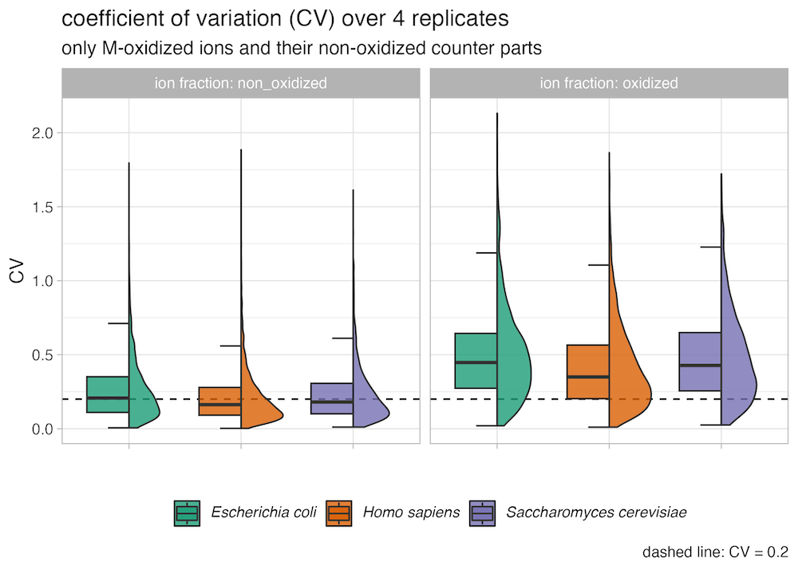

# SpectroPipeR 

a streamlining post Spectronaut® DIA-MS data analysis R package

## How to cite

Stephan Michalik, Elke Hammer, Leif Steil, Manuela Gesell Salazar, Christian Hentschker, Kristin Surmann, Larissa M Busch, Thomas Sura, Uwe Völker, SpectroPipeR — a streamlining post Spectronaut® DIA-MS data analysis R package, Bioinformatics, Volume 41, Issue 3, March 2025, btaf086, https://doi.org/10.1093/bioinformatics/btaf086

## Manual

The manual can be found under https://stemicha.github.io/SpectroPipeR/

- [SpectroPipeR - how to start](https://stemicha.github.io/SpectroPipeR/)
- [SpectroPipeR - step 1 - read Spectronaut data](https://stemicha.github.io/SpectroPipeR/articles/a01_SpectroPipeR_read_Spectronaut_data.html)
- [SpectroPipeR - step 2 - normalization and quantification](https://stemicha.github.io/SpectroPipeR/articles/a02_SpectroPipeR_norm_quant.html)
- [SpectroPipeR - step 3 - MVA analysis](https://stemicha.github.io/SpectroPipeR/articles/a03_SpectroPipeR_MVA_analysis.html)
- [SpectroPipeR - step 4 - statistics](https://stemicha.github.io/SpectroPipeR/articles/a04_SpectroPipeR_statistics.html)
- [SpectroPipeR - step 5 - reporting](https://stemicha.github.io/SpectroPipeR/articles/a05_SpectroPipeR_reporting.html)
- [SpectroPipeR - additional feature - XIC plotting module](https://stemicha.github.io/SpectroPipeR/articles/a06_SpectroPipeR_XIC_plot.html)
- [SpectroPipeR - example code - functional enrichment analysis (external package)](https://stemicha.github.io/SpectroPipeR/articles/a07_Gprofiler2_code_suggestion.html)
- [SpectroPipeR - example code - single protein plot code suggestion](https://stemicha.github.io/SpectroPipeR/articles/a08_single_protein_plot_code_suggestion.html)

<!-- badges: start -->
[](/LICENSE)


**contact:**
Stephan Michalik (stephan.michalik@uni-greifswald.de)

<!-- badges: end -->

## video tutorial

[](https://www.youtube.com/watch?v=zmN0ji-c__w)

## Introduction

During proteome studies, researchers frequently face various challenges, some of which can be mitigated while others cannot. A prevalent issue is the bottleneck in downstream data analysis, which arises due to a limited number of bioinformaticians, rapid generation of raw data, and variations in data analysis methods or workflows.

To tackle this problem SpectroPipeR was developed.  This pipeline is designed to simplify data analysis tasks, significantly reduce the workload for scientists, be easily expandable, user-friendly even for those with minimal bioinformatic background, generate standardized analysis, outputs, and reports for each project, and produce publication-ready tables, figures, and reports.

SpectroPipeR comprises a set of R functions that facilitate a comprehensive, fully automated, and standardized data analysis of Spectronaut® DIA-MS data. This includes ID rate summary, ON/OFF analysis, normalization, batch or covariate adjustment, iBAQ and MaxLFQ quantification, multivariate analysis, peptide-centric statistical analysis (ROPECA, modified t-test or t-test), and interactive HTML report generation. The output is presented through a variety of clear graphs and tables in a well-structured folder system. The comprehensive standalone HTML report is extremely useful for existing Electronic Laboratory Notebooks (ELN) or Laboratory Information Management Systems (LIMS) to quickly obtain a project-specific overview.

SpectroPipeR consists of a global parameter setting and four analysis modules and one reporting module that are executed sequentially. This modular approach allows flexibility where specific analyses like ID- and intensity plots can be run independently or as part of the complete pipeline.

After each module execution, dynamic console feedback is provided and written to a log file to help identify errors early on. Upon completion of all modules, a comprehensive set of tables and plots categorized in different folders is generated to summarize the project from various perspectives.

SpectroPipeR includes also a module for XIC plotting, capable of generating protein-specific XIC plots for each ion associated with the protein. This is complemented by a range of significant metrics designed to aid in evaluating the accuracy of both identification and quantification.

## Recommended minimum system requirements

- *Processor:* Multi-core CPU, with at least 8-12 cores (12 cores recommended)
- *Memory (RAM):* Minimum 16-32 GB (64 GB recommended for larger datasets, e.g. 1200 neat plasma samples)
- *Storage:* SSD with at least 100 GB free space for intermediate files and results
- *Operating System:* Linux, MacOS, or Windows with the latest R version installed

## Spectronaut® required version & missing value settings

### required version

SpectroPipeR needs at least Spectronaut® version 18.7.240506.55695 to be fully functional.

### missing value settings

**Currently, SpectroPipeR does not incorporate mechanisms to address missing values (complete matrix required!).**
However, given the availability of sophisticated missing value imputation algorithms within Spectronaut®, we would like to offer our recommendations for utilizing these features effectively.

During the Analysis setup (DIA-Analysis or directDIA-Analysis) inside Spectronaut® go to:

- **DIA Analysis > Quantification > Precursor Filtering > Imputing strategy**

In order to use SpectroPipeR the one of following settings should be be used.

**Imputing strategy:** (Excerpt from the Spectronaut® manual) the imputing strategy defines how to estimate the missing values (identifications not fulfilling the FDR threshold).

- <u><em>Use Empirical Noise:</u></em> the best real picked signal will be reported.
- <u><em>Global Imputing:</u></em> missing values are imputed based on a random sampling from a distribution of low abundant signals taken across the entire experiment.
- <u><em>Run Wise Imputing:</u></em> missing values are imputed based on a random sampling from a distribution of low abundant signals taken within the corresponding run. This is useful for large scale experiment


**DO NOT USE "NONE"! (in DIA Analyisis > Quantification > Precursor Filtering > Imputing strategy)**


## Installation

You can install the development version of SpectroPipeR like so:

- install R using https://cran.r-project.org.
- <u>optional:</u> install RStudio IDE using https://posit.co/download/rstudio-desktop/
- inside R execute the following code:

``` r
# install devtools
install.packages("devtools")

# install Bioconductor dependencies
if (!require("BiocManager", quietly = TRUE))
    install.packages("BiocManager")
BiocManager::install(c("PECA", "sva"))

# install SpectroPipeR from github
devtools::install_github("stemicha/SpectroPipeR")

# quit and restart R or restart R session in Rstudio
```

## Requirements

For the interactive html report feature SpectroPipeR needs **Quarto CLI**.
Quarto is an open-source scientific and technical publishing system.
You can install the Quarto CLI using [Quarto get started installation](https://quarto.org/docs/get-started/).

## Spectronaut® report requirements

SpectroPipeR requires certain columns from the Spectronaut® output report that are not included by default.

_The following steps are advised:_

1. **download and installation of SpectroPipeR (if not already done)**
2. **load the SpectroPipeR package and utilize the `Spectronaut_export_scheme()` function to create the necessary Spectronaut® report scheme (SpectroPipeR_report.rs) in the output folder provided.**
``` r
# load library
library(SpectroPipeR)
# output_location: path to output folder for the SpectroPipeR_report.rs Spectronaut® report scheme
Spectronaut_export_scheme(output_location = "../SpectroPipeR_test_folder")
```
3. **import the generated SpectroPipeR report scheme (SpectroPipeR_report.rs) into Spectronaut®**
4. **conduct an analysis of your raw mass spectrometry data in Spectronaut® and define conditions during analysis setup process**
5. **produce the output report (*.tsv) using the imported SpectroPipeR report scheme**
6. **open R and use/edit code below to perform your analysis**

``` r
# load library
library(SpectroPipeR)

# edit strings inside quotes

# use/edit default parameters list // define output folder (mandatory !)
params <- list(output_folder = "[your path to output folder]")

# add your path to your Spectronaut report (*.tsv)
file_path <- "[your path to Spectronaut report (*.tsv)]"

# add your condition comparisons as named in Spectronaut analysis setup
condition_comp = cbind(c("[condition_2]","[condition_1]"),
                       c("[condition_3]","[condition_1]")
                        )

# launch analysis
SpectroPipeR_analysis <- SpectroPipeR(file = file_path,
                                      parameter = params,
                                      condition_comparisons = condition_comp
                                      )

```


Spectronaut® output report should contain the following columns to work in SpectroPipeR (these are included when using the scheme generated by `Spectronaut_export_scheme()`):


<u>Mandatory Spectronaut® report columns:</u>

R.FileName, R.Condition, R.Replicate, R.Instrument Name, R.Raw File Name, R.MS1 Mass Analyzer, R.MS2 Mass Analyzer, R.Run Date, PG.ProteinGroups, PG.Organisms, PG.IBAQ, PEP.StrippedSequence, EG.ModifiedPeptide, PEP.NrOfMissedCleavages, EG.UserGroup, EG.Qvalue, EG.PEP, EG.Cscore, EG.NormalizationFactor, EG.TotalQuantity (Settings), EG.SignalToNoise, EG.Identified, EG.ApexRT, EG.IntCorrScore, EG.DatapointsPerPeak, EG.DatapointsPerPeak (MS1), FG.Charge, FG.Id, FG.XICDBID, FG.LabeledSequence, FG.ShapeQualityScore, FG.MS1Quantity, FG.MS2Quantity, FG.MS1RawQuantity, FG.MS2RawQuantity

EG.TotalQuantity (Settings) is used for the quantification. 
Per default MS2 level should be selected in the quantification setting in Spectronaut®.

## code example

### all-in-one function example:

``` r
# load library
library(SpectroPipeR)

# use default parameters list
params <- list(output_folder = "../SpectroPipeR_test_folder")

# example input file // or path to your Spectronaut® report (*.tsv)
example_file_path <- system.file("extdata", "SN_test_HYE_mix_file.tsv", package="SpectroPipeR")

# launch analysis
SpectroPipeR_analysis <- SpectroPipeR(file = example_file_path,
                                      parameter = params,
                                      condition_comparisons = cbind(c("HYE mix A",
                                                                      "HYE mix B"))
                                      )

```


### single function execution example:

``` r
# load library
library(SpectroPipeR)


# use default parameters list
params <- list(output_folder = "../SpectroPipeR_test_folder")

# example input file // or path to your Spectronaut® report (*.tsv)
example_file_path <- system.file("extdata",
                                 "SN_test_HYE_mix_file.tsv",
                                 package="SpectroPipeR")

# step 1: load Spectronaut® data module
SpectroPipeR_data <- read_spectronaut_module(file = example_file_path,
                                             parameter = params)

# step 2: normalize & quantification module
SpectroPipeR_data_quant <- norm_quant_module(SpectroPipeR_data = SpectroPipeR_data)

# step 3: MVA module
SpectroPipeR_MVA <- MVA_module(SpectroPipeR_data_quant = SpectroPipeR_data_quant,
           HCPC_analysis = FALSE)

# step 4: statistics module
SpectroPipeR_data_stats <- statistics_module(SpectroPipeR_data_quant = SpectroPipeR_data_quant,
                                       condition_comparisons = cbind(c("HYE mix A",
                                                                      "HYE mix B")))

# step 5: report module
SpectroPipeR_report_module(SpectroPipeR_data = SpectroPipeR_data,
                           SpectroPipeR_data_quant = SpectroPipeR_data_quant,
                           SpectroPipeR_data_stats = SpectroPipeR_data_stats)

```

### SpectroPipeR GUI


``` r
# load library
library(SpectroPipeR)

# load SpectroPipeR GUI
SpectroPipeR_ui()
```

The `SpectroPipeR_ui()` function launches a user interface in the browser, providing access to the majority of SpectroPipeR's functionalities.


### SpectroPipeR usage in Terminal/Bash

If all the necessary packages are correctly installed, you can also execute SpectroPipeR analysis from the terminal using bash. Sometimes, extensive analyses require more computational power and memory, so it might be beneficial to run them on a server.

Here is a basic example that you can use as a starting point, which you can save as "SpectroPipeR_terminal.sh"

``` bash
#!/bin/bash

# Command line arguments
input_file=$1
parameter=$2
condition_comparisons=$3


# usage
# bash SpectroPipeR_terminal.sh "SN_test_HYE_mix_file.tsv" "output_folder=SpectroPipeR_test_folder;stat_test=modt;ion_q_value_cutoff=0.001" "HYE mix A,HYE mix B;HYE mix B,HYE mix A"

# R script
Rscript -e "
library(SpectroPipeR)

print(\"$parameter\")
print(\"$input_file\")
print(\"$condition_comparisons\")


# split parameters
params <- strsplit(\"$parameter\",split = \";\")
params <- strsplit(unlist(params),\"=\")
names(params) <- lapply(params, function(x) x[1])
params <- lapply(params, function(x) x[2])

# convert parameters class
convert_params <- function(params) {
  numeric_params = c(\"ion_q_value_cutoff\",
                     \"id_drop_cutoff\",
                     \"normalization_factor_cutoff_outlier\",
                     \"fold_change\",
                     \"p_value_cutoff\")
  logical_params = c(\"filter_oxidized_peptides\",
                     \"paired\")
  # iterate over each parameter
  for (param in names(params)) {
    # check if parameter is in numeric_params
    if (param %in% numeric_params) {
      # convert to numeric
      params[[param]] <- as.numeric(params[[param]])
    }
    # check if parameter is in logical_params
    else if (param %in% logical_params) {
      # convert to logical
      params[[param]] <- as.logical(params[[param]])
    }
  }
  return(params)
}

params <- convert_params(params)

# split condition comparisons
cond_comp <- strsplit(\"$condition_comparisons\",split = \";\")
cond_comp <- sapply(unlist(cond_comp), function(x) strsplit(x,split = \",\"))
cond_comp <- do.call(cbind,cond_comp)

class(params)
print(params)

# perform the analysis
SpectroPipeR_analysis <- SpectroPipeR(file = \"$input_file\",
                                     parameter = params,
                                     condition_comparisons = cond_comp
                                     )
"


```

Example terminal usage:

bash SpectroPipeR_terminal.sh [input_file] [named parameters separated by ;] [condition comparisons separated by ;]

``` terminal
bash SpectroPipeR_terminal.sh "SN_test_HYE_mix_file.tsv" "output_folder=SpectroPipeR_test_folder;stat_test=modt;ion_q_value_cutoff=0.001" "HYE mix A,HYE mix B;HYE mix B,HYE mix A"
```

## selected options of SpectroPipeR

### SpectroPipeR condition-wise filtering (optional)

The `ID_condition_filtering` option, when used in conjunction with `ID_condition_filtering_percent`, enables users to filter ions that are present in a specified proportion of replicates per condition. This functionality facilitates the exclusion of ions that are, for instance, detected only once within a given condition.

``` r
# load library
library(SpectroPipeR)

# SpectroPipeR analysis with ions only present in 100% of replicates per condition
SpectroPipeR_analysis <- SpectroPipeR(file = example_file_path,
                                      parameter = params,
                                      ID_condition_filtering = T,
                                      ID_condition_filtering_percent = 1,
                                      condition_comparisons = cbind(c("HYE mix A",
                                                                      "HYE mix B"))
                                      )

```

``` r
# load library
library(SpectroPipeR)

# SpectroPipeR analysis with ions only present in 50% of replicates per condition
SpectroPipeR_analysis <- SpectroPipeR(file = "Spectronaut_SpectroPipeR_report_file.tsv",
                                      parameter = list(output_folder = "output_folder"),
                                      ID_condition_filtering = T,
                                      ID_condition_filtering_percent = 0.5,
                                      condition_comparisons = cbind(c("HYE mix A",
                                                                      "HYE mix B"))
                                      )

```

The following schematic illustrates the condition-specific filtering process in SpectroPipeR.


The additional filtering step can potentially enhance the robustness of your data by ensuring that only ions detected across multiple replicates are utilized for quantitative and statistical analysis.

### Remove methionine oxidized peptides before quantitative analysis  (optional)

Methionine oxidation during sample preparation is a significant concern, particularly when using e.g. 2-chloroacetamide (CA) as an alkylating agent.
The oxidation of methionine increases dramatically with CA, affecting up to 40% of all Met-containing peptides, compared to only 2-5% with iodoacetamide (IOA) (Hains, P. G. & Robinson, P. J. - 10.1021/acs.jproteome.7b00022). 
This extensive oxidation can cause qualitative and quantitative issues in large-scale proteomics studies, complicating data analysis and increasing the search space required for database matching. 

Methionine oxidation has been also observed to accumulate spuriously during the initial stages of a typical bottom-up proteomics workflow. 
Notably, the extent of methionine oxidation increases with prolonged trypsin digestion and higher ionization energy during electrospray ionization (ESI) (Zang, L. *et al.*, 2012 - 10.1016/j.jchromb.2012.03.016; Chen, M. & Cook, K. D. - 10.1021/ac061743r).

These observations complicate the differentiation between methionines oxidized *in vivo* and those artifactually oxidized *in vitro* during sample 
preparation and mass spectrometric analysis.

SpectroPipeR includes an option to remove oxidized methionine peptides. 


``` r
# load library
library(SpectroPipeR)

# SpectroPipeR analysis with removing oxidized methionine peptides
SpectroPipeR_analysis <- SpectroPipeR(file = "Spectronaut_SpectroPipeR_report_file.tsv",
                                      parameter = list(output_folder = "output_folder",
                                                       # remove Met-ox. peptides
                                                       filter_oxidized_peptides = TRUE),
                                      condition_comparisons = cbind(c("HYE mix A",
                                                                      "HYE mix B"))
                                      )

```

This is recommended because species mix experiments have shown that the non-oxidized (methionine containing peptides) fraction of the peptide exhibits a lower coefficient of variation and better conservation of expected ratios compared to the oxidized fraction of the peptides.





## SpectroPipeR and missing values

Missing values should be handled using the integrated workflows and options available in Spectronaut™.
However, residual missing values—especially those affecting a small subset of ions—may still occur. In such cases, SpectroPipeR automatically performs imputation by sampling from a distribution generated by halving the values within the lowest 1st percentile of observed ion intensities. This derived distribution serves as the basis for imputing the remaining missing values.


## directLFQ implementation

directLFQ stands for Direct Label-Free Quantification.
Based on the python code https://github.com/MannLabs/directlfq a R implementation (using python package of directLFQ) was done by Zhenhuan Feng (https://github.com/mildpiggy/Rdirectlfq).

For details of the algorithm please read:
Ammar, C., Schessner, J. P., Willems, S., Michaelis, A. C. & Mann, M. Accurate label-free quantification by directLFQ to compare unlimited numbers of proteomes. (2023) 
doi:10.1101/2023.02.17.528962.


Simple steps of the directLFQ algorithm:

- Form intensity traces: treat samples or ions as traces of log2 intensities to be shifted, not reshaped.
- Compute one scaling factor per trace: add a constant (log-space) to each trace to minimize distances between traces, preserving shapes and relative changes.
- Pairwise compare traces and iteratively merge the most similar ones until all are aligned (shifted on top of each other).
- Between-sample normalization: apply the learned per-sample factors to correct systematic shifts across samples.
- Protein intensity estimation: after aligning ion traces, take the median per sample as the protein’s relative intensity, then convert back to linear space and rescale to retain total peptide intensity.

### directLFQ comparison in HYE species mix measurements


