```{r, include = FALSE}
knitr::opts_chunk$set(
  eval = FALSE,
  collapse = TRUE,
  comment = "#>"
)
library(kableExtra)
library(tidyverse)
library(readxl)
table_font_size <- 10
```


::: {#Tip1 .greeting .message style="color: blue;"}

**If you want to have a closer look at the images and plots just do a
"right-click" on the image and select "open in new tab"**
:::

::: {#Tip2 .greeting .message style="color: green;"}
**The output folders contained figures that were always exported in two file formats: vector PDF and raster PNG.**

<u>Recommendations for MacOS Users</u>

For MacOS users, it is recommended to use the PDF files, for example in Keynote, to achieve better quality.

<u>Recommendations for Windows Users</u>

For Windows users, it is recommended to use the PNG files, as applications like Microsoft PowerPoint can sometimes have issues when working with vector graphics.

:::


# Requirements

SpectroPipeR require the Quarto CLI. please make sure you installed it on your system ! [https://quarto.org/docs/get-started/](https://quarto.org/docs/get-started/)

SpectroPipeR also requires certain columns from the Spectronaut output report that
are not included by default.

<u>The following steps are advised:</u>

1.  download and install SpectroPipeR (https://github.com/stemicha/SpectroPipeR)
2.  load SpectroPipeR and utilize the `Spectronaut_export_scheme()` function to create
    the necessary Spectronaut report scheme (\*.rs).
3.  Import the generated Spectronaut report scheme.
4.  Conduct an analysis of your raw mass spectrometry data in
    Spectronaut and produce the output report using the imported report
    scheme.

## Spectronaut output report file

Spectronaut output report should contain the following columns to work in SpectroPipeR:

```{r, eval = T, echo = F}
knitr::kable(tibble::tibble("mandatory Spectronaut columns" = c("R.FileName",
                       "R.Condition",
                       "R.Replicate",
                       "R.Run Date",
                       "R.Instrument Name",
                       "R.Raw File Name",
                       "R.MS1 Mass Analyzer",
                       "R.MS2 Mass Analyzer",
                       "PG.ProteinGroups",
                       "PG.Organisms",
                       "PG.IBAQ",
                       "PEP.StrippedSequence",
                       "EG.ModifiedPeptide",
                       "PEP.NrOfMissedCleavages",
                       "EG.UserGroup",
                       "EG.Qvalue",
                       "EG.Cscore",
                       "EG.NormalizationFactor",
                       "EG.TotalQuantity (Settings)",
                       "EG.SignalToNoise",
                       "EG.Identified",
                       "EG.ApexRT",
                       "EG.IntCorrScore",
                       "EG.DatapointsPerPeak",
                       "EG.DatapointsPerPeak (MS1)",
                       "FG.Charge",
                       "FG.Id",
                       "FG.XICDBID",
                       "FG.LabeledSequence",
                       "FG.ShapeQualityScore",
                       "FG.MS1Quantity",
                       "FG.MS2Quantity",
                       "FG.MS1RawQuantity",
                       "FG.MS2RawQuantity")
                       ), 
             align = "r"
             )
```

The Spectronaut_export_scheme() function can be utilized to generate a Spectronaut report template (*.rs). This template should then be imported into Spectronaut. Subsequently, the analysis of your mass spectrometry raw data should be conducted and documented using this template within Spectronaut.

```{r}
Spectronaut_export_scheme(output_location = "../SpectroPipeR_test_folder")
```


# parameters

The global SpectroPipeR analysis paramaters is a list element containing the
basic analysis project information SpectroPipeR needs to process the data.

| <u> **parameter** </u>             | <u> **description** </u>                                                                                                                                                                                                                    |
|:----------------|:------------------------------------------------------|
| output_folder                      | *character* - output folder path (abs.)                                                                                                                                                                                                     |
| ion_q_value_cutoff                 | *numeric* - Q-value used in Spectronaut analysis: Biognosys default is 0.01 = 1% error rate                                                                                                                                                 |
| id_drop_cutoff                     | *numeric* - value between 0-1 (1 = 100%); xx percent lower than median of ion ID rate =\> outlier                                                                                                                                           |
| normalization_method               | *character* - "median" or Spectronaut; auto-detection is per default ON, meaning if normalization was performed in Spectronaut this will be detected and preferred over parameter setting here; median normalization is the fallback option |
| normalization_factor_cutoff_outlier | *numeric* - median off from global median (4 means abs. 4fold off)                                                                                                                                                                          |
| filter_oxidized_peptides           | *logical* - if oxidized peptides should be removed from peptide quantification                                                                                                                                                              |
| protein_intensity_estimation       | *character* - Hi3 = Hi3 protein intensity estimation, MaxLFQ = MaxLFQ protein intensity estimation                                                                                                                                          |
| stat_test                          | *character* - choose statistical test: "rots" = reproducibility optimized test statistics, "modt" = moderate t-test (lmfit, eBayes), "t" = t-test                                                                                           |
| type_slr                           | *character* - choose ratio aggregation method: "median" or "tukey" is used when calculating protein values                                                                                                                                  |
| fold_change                        | *numeric* - fold-change used as cutoff e.g. 1.5                                                                                                                                                                                             |
| p_value_cutoff                     | *numeric* - p-value used as cutoff e.g. 0.05                                                                                                                                                                                                |
| paired                             | *logical* - Should paired statistics be applied?                                                                                                                                                                                            |

::: {#Attention .greeting .message style="color: red;"}

**Attention:**

If a Q-value of 0.01 is applied in Spectronaut and a Q-value of 0.001 is established within SpectroPipeR, it will impact the ID counting. However, this change will NOT affect the quantification. The Spectronaut report will be used as it is for quantification if no other filtering was selected.

:::

## filter_oxidized_peptides parameter


In SpectroPipeR, users can optionally set the `filter_oxidized_peptides` parameter to `TRUE` to remove peptides containing oxidized methionines while retaining their unmodified counterparts. This filtering is recommended because experiments using HYE species mixtures have demonstrated that methionine-oxidized peptides exhibit significantly lower intensity and suffer from markedly reduced relative quantitative precision compared to their unmodified forms. Additionally, the variation between replicate measurements is also substantially higher for oxidized peptides. Consequently, removing methionine-oxidized peptides before quantification and statistical analysis is the recommended approach in SpectroPipeR to ensure optimal results.

### HYE species mix experiements

The HYE species mix experiments were carried out with 4 replicates as described in [A multicenter study benchmarks software tools for label-free proteome quantification](https://www.nature.com/articles/nbt.3685). The data can be accessed via MassIVE (MSV000092489) - https://massive.ucsd.edu/ProteoSAFe/dataset.jsp?task=0f33717d84fd45b1a318ad40670022cc.

Spectronaut version 18.6 was used for data analysis. Following filtering, the ion data only included peptides containing methionine oxidation without prior carbamidomethylation, along with their unmodified counterparts. To determine quantitative ratios, mix A ion intensities were divided by the corresponding ion intensities from mix B.

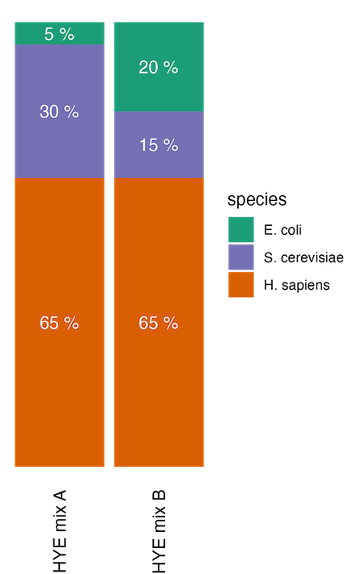{width=30%}

#### HYE species mix experiements results regarding methionine oxidation

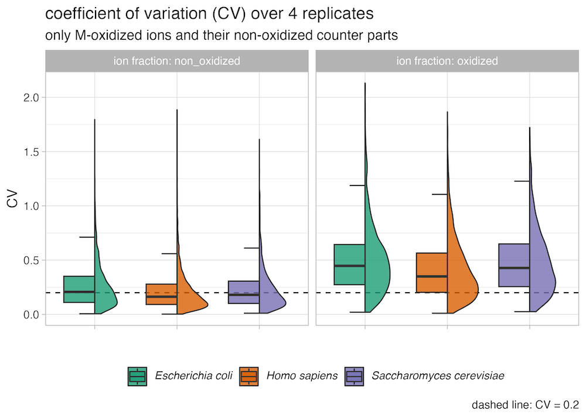{width=80%}


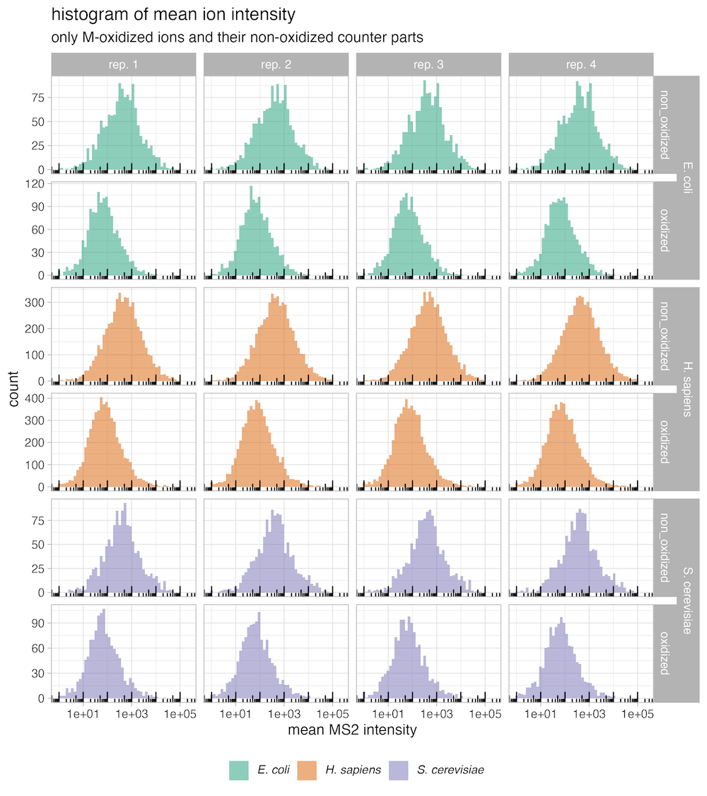{width=80%}


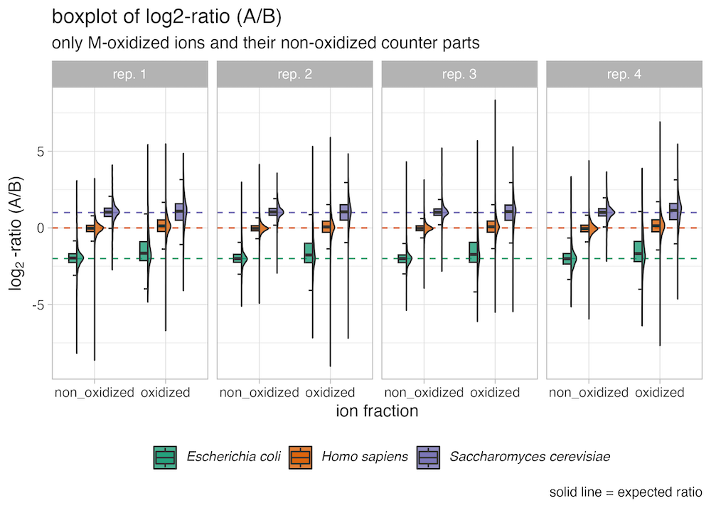{width=80%}


# SpectroPipeR - output folder structure

The specified output folder is essential. If it does not exist it will be created.
Inside a SpectroPipeR specific folder structure will be generated.

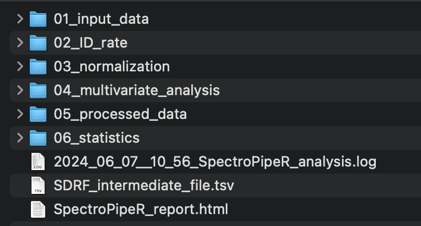{width=50%}

# SpectroPipeR - read Spectronaut data module

The `read_spectronaut_module()` function serves to ingest and process
data from the Spectronaut software platform. This function performs the
following key tasks:

<u>**data loading:**</u> - Reads in the raw data from the Spectronaut report -
Prepares the data for use within the SpectroPipeR analysis environment

<u>**ID analysis:**</u> - Provides feedback on key qualitative
characteristics of the analysis - Includes metrics such as: -
Identification (ID) rates - ON/OFF analysis results - Other relevant
qualitative insights

## read_spectronaut_module() workflow

1.  check parameters
2.  genrate output folders
3.  init log file
4.  load spectronaut report data
5.  check columns
6.  write input data to `01_input_data` folder in specified output
    folder
7.  perform raw file name capping for better visibility inside plots
8.  reformat Q-value (EG.Qvalue = mixed column (character and numeric))
9.  (optional) ID condition filtering; keep only data for downstream
    analysis which passes condition-wise percentage filtering
10. generate and export intermediate SDRF file
11. export short summary of ID rates to log file
12. performing counting of min. sample percentage where an ion was
    detected for user feedback in log
13. count ID rates (ions, peptides, protein groups) by filtering for the
    specified Q-value in parameters list
14. get ID rates for 1 or at least 2 peptide hits
15. determine ion ID median to estimate ID outliers on that basis
    depending on the parameters list value
16. generate ID tables and ID plots
17. The ON/OFF analysis is conducted by filtering the data to include
    only proteins with a minimum of 2 peptide hits that are present in
    at least 50% of the sample replicates, with proteins meeting this
    criteria being classified as "ON" and those failing to do so being
    designated as "OFF".
18. generate ON/OFF analysis tables, plots and UpSet analysis
19. extract missed cleavages rates globally and on run level

### SDRF file 

"Public proteomics data often lack essential metadata, limiting its potential. To address this, we present lesSDRF, a tool to simplify the process of metadata annotation, thereby ensuring that data leave a lasting, impactful legacy well beyond its initial publication." *Claeys, T. et al., 2023,  Nat. Commun. 14, 6743*

SpectroPipeR generates a intermediate SDRF tsv file, please use https://lessdrf.streamlit.app for finalizing file before submitting to a public repository. The "source name" is generated by using the R.Condition and R.Replicate column. Please carefully check column names and edit and refine them according to https://github.com/bigbio/proteomics-sample-metadata/tree/master/sdrf-proteomics.


For further information please read [lesSDRF is more: maximizing the value of proteomics data through streamlined metadata annotation](https://www.nature.com/articles/s41467-023-42543-5)


### ON/OFF analysis details

1. determine number of replicates per condition
2. filtering the ions for the used Q-value cutoff specified in the parameters
3. filter for ProteinGroups with 2 or more peptides
4. count ProteinGroups per condition
5. calculate in how many replicates the ProteinGroup was identified with 2 or more peptides with a Q-value cutoff below the specified one in the parameters
6. filter the list for ProteinGroups found only in at least 50% of replicates per condition
7. generate the wide output

## example code

```{r}
# load SpectroPipeR
library(SpectroPipeR)
# example input file, bundled with SpectroPipeR package
example_file_path <- system.file("extdata", "SN_test_HYE_mix_file.tsv", package="SpectroPipeR")
```

```{r}
# use default parameters list
params <- list(output_folder = "../SpectroPipeR_test_folder")
```

```{r}
# step 1: load Spectronaut data module
SpectroPipeR_data <- read_spectronaut_module(file = example_file_path,
                                      parameter = params,
                                      print.plot = FALSE)
```

```{r}
# checking parameters ...
# #*****************************************
# # READ SPECTRONAUT MODULE
# #*****************************************
# 
# loading data ...
# write input data to output folder ...                                          
# R.FileName capping ...                                                                                    
# 02_ID_rate/8_sample_analysis ATTENTION !!! ---> folder already exists - files will be replaced !!!
# _________ data set loaded with ... _________
# number of raw files = 8
# number of conditions = 2
# number of ions without filtering = 16654
# number of peptides without filtering = 12761
# number of Protein groups without filtering = 1503
# count profiled values ...
# performing counting of min. sample percentage where an ion was detected...
# ion Q-value cutoff < 0.01
# 12.5 % (1/8) is the min. sample percentage where an ion was detected
# performing ID rate filtering ...
# performing protein count over replicates (more than or equal 2 peptides) ...
# performing protein count (<2 and more than or equal 2 peptides) ...
# _________ ON/OFF analysis: _________                                                                
# ... filter with Q-value 0.01 ...
# ... filter for 2 peptides and min. present in 50% of replicates ...
# ... ON/OFF analysis write outputs ...
# _________ ID rate per sample: _________                                                                 
# ions: median = 16205; min. = 15575; max. = 16541
# modified peptides: median = 12850; min. = 12409; max. = 13072
# stripped peptides: median = 12468.5; min. = 12042; max. = 12682
# protein groups: median = 1485.5; min. = 1470; max. = 1499
```


## read_spectronaut_module() outputs

The output in your specified output folder of the
read_spectronaut_module() function should look like in this example:

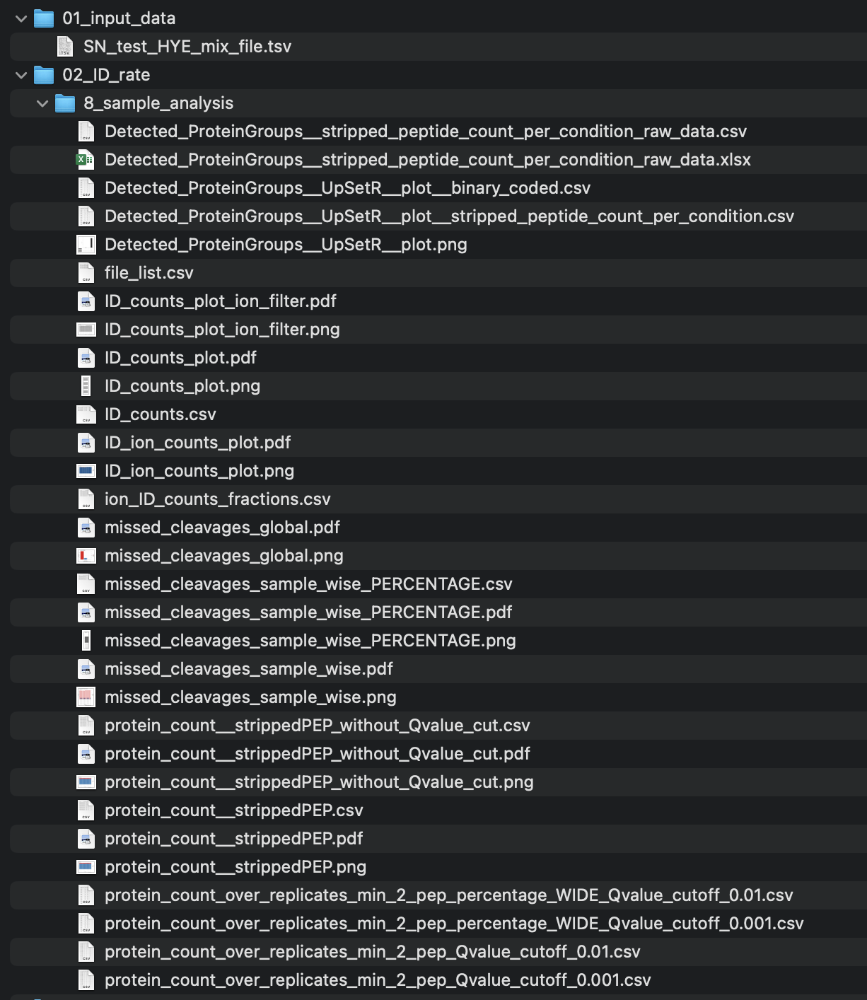{width="50%"}


<!-- figures read Spectronaut data -->

### figures {.tabset .tabset-pills}

#### ID_counts_plot

The bar chart labeled as **ID_counts_plot** illustrates the number of
identifications (IDs) discovered at the ion, peptide, and protein group
levels, corresponding to user specified Q-value. It is advisable to
select the same Q-value as defined in Spectronaut.

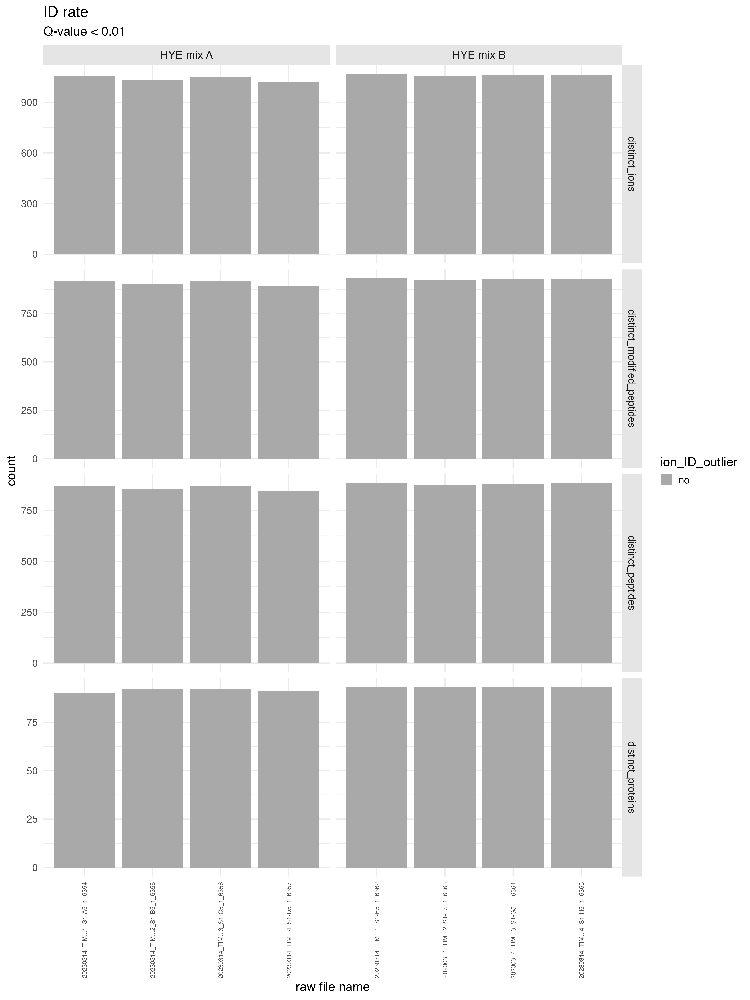{width="40%"}

#### ID_counts_plot_ion_filter

The bar chart labeled as **ID_counts_plot_ion_filter** depicts only the
ions counts corresponding to user specified Q-value. The dotted line in
the graph represents the median count of ions, while the solid line
indicates the threshold criteria for defining an outlier run. If the
'id_drop_cutoff' parameter is set to 0.3, this implies that the cutoff
criteria for identifying potential ID outliers is determined by the
formula `median of ion count * (1-0.3)`. A run with an ion count below
this line would be highlighted in orange and labeled as an ID outlier.

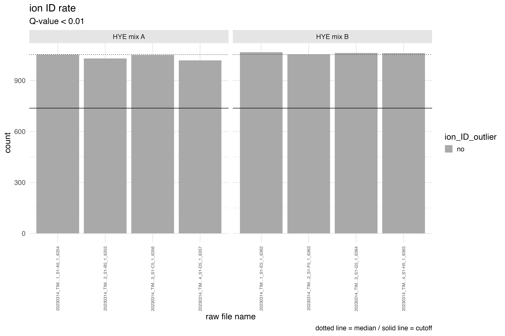{width="50%"}

#### ID_ion_counts_plot

The bar chart, titled **ID_ion_counts_plot**, presents the ion
identifications (IDs) in a stacked barchart format. It differentiates
between ions discovered below the specified Q-value threshold (depicted
in blue), those found above the threshold (shown in grey), and the
profiled ions (represented in red).

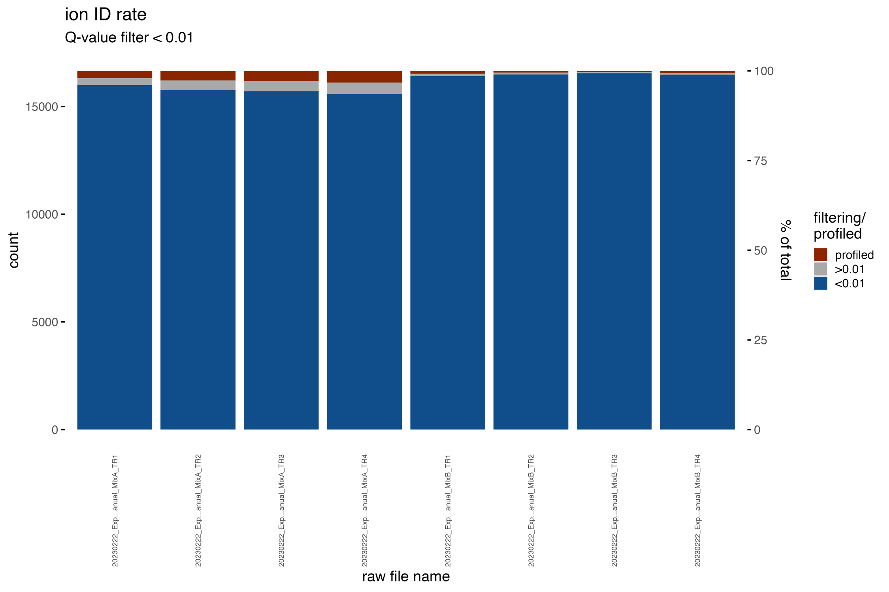{width="50%"}

#### missed_cleavages_sample_wise

The bar chart, titled **ID_ion_counts_plot**, depicts the number of
missed cleavages per run. The text above the bar indicates the missed
cleavage percentage.

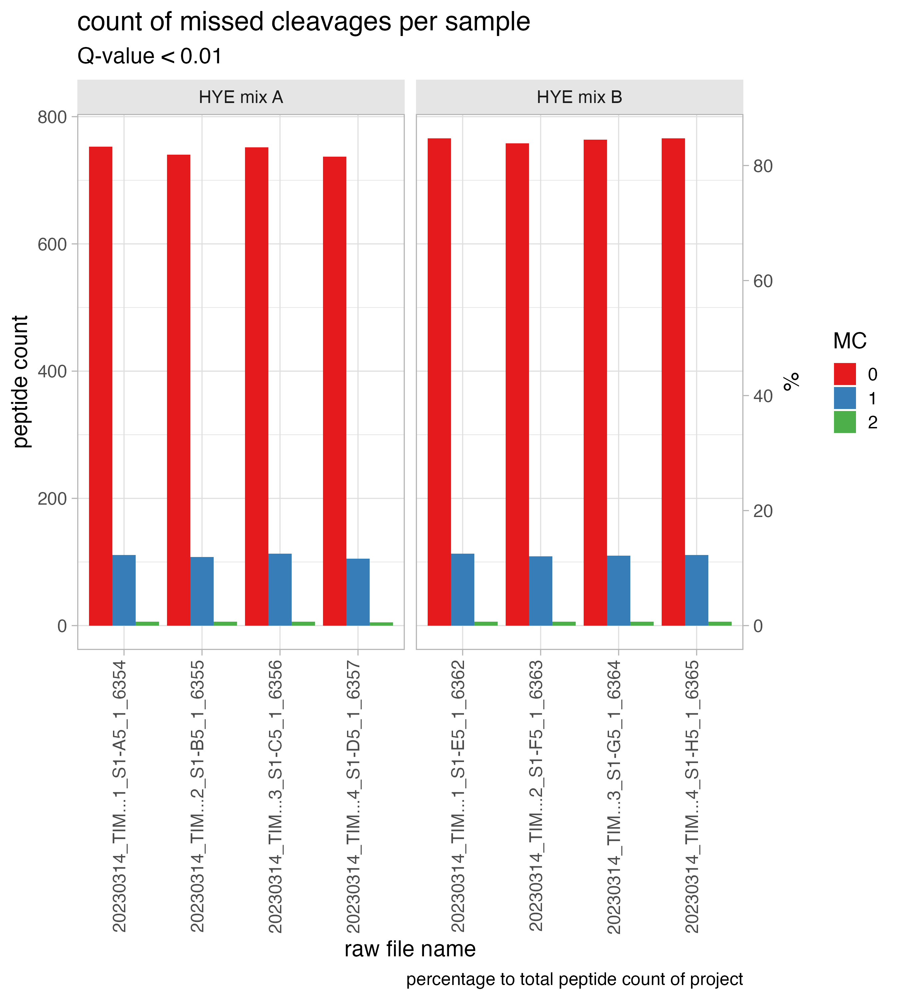{width="50%"}

#### missed_cleavages_sample_wise_PERCENTAGE

The bar chart, titled **missed_cleavages_sample_wise_PERCENTAGE**, shows
the number of peptides with x-missed cleavages (y-axis left side) and
the percentage (y-axis right side) per run.

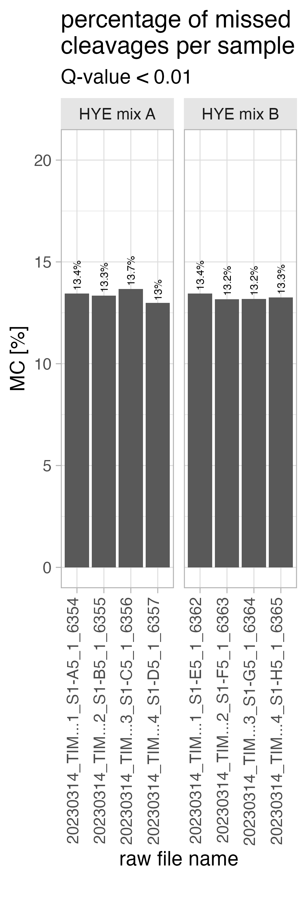{width="30%"}

#### missed_cleavages_global

The bar chart, titled **missed_cleavages_global**, depicts the missed
cleavage rate for the whole project.

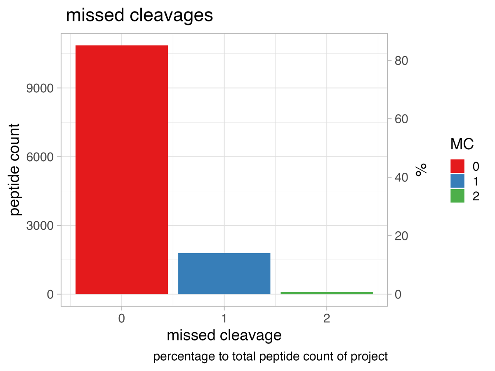{width="50%"}

#### Detected_ProteinGroups\_\_UpSetR\_\_plot

The UpSet plot (**Detected_ProteinGroups\_\_UpSetR\_\_plot**)
illustrates the outcome from the ON/OFF analysis. The ON/OFF analysis is
conducted by filtering the data to include only proteins with a minimum
of 2 peptide hits that are present in at least 50% of the sample
replicates, with proteins meeting this criteria being classified as "ON"
and those failing to do so being designated as "OFF".

If you want to know about the principle of an UpSet plot visit
<https://en.wikipedia.org/wiki/UpSet_plot>

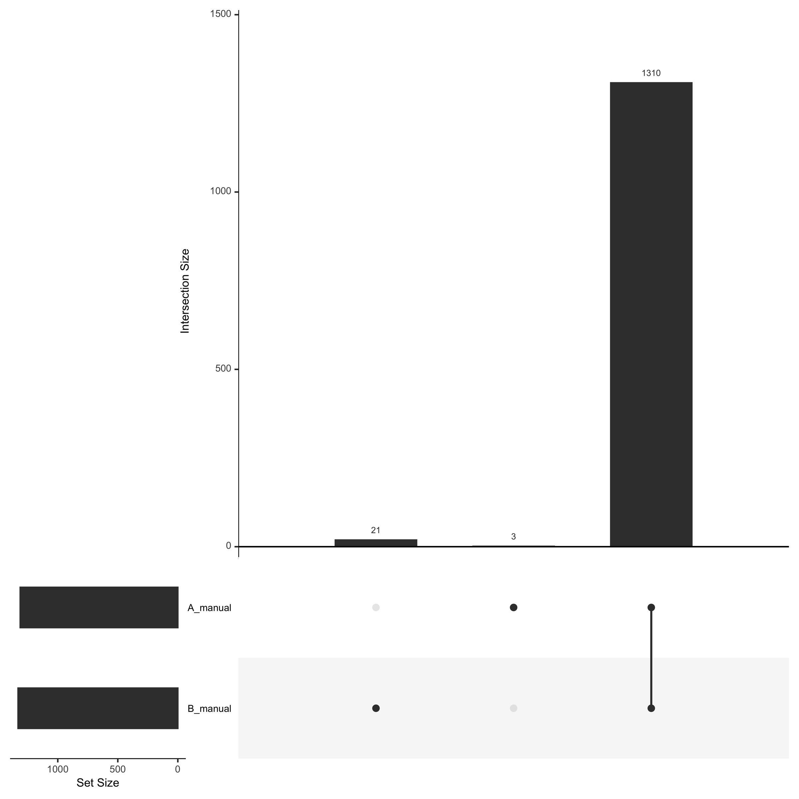{width="50%"}

<!-- tables read Spectronaut data -->

### tables {.tabset .tabset-pills}

#### file_list.csv

The **file_list.csv** table contains 4 columns and gives a brief
overview of the files used in the project

-   <u>R.FileName</u> is the capped raw file name
-   <u>R.FileName_raw</u> is the un-capped version of the raw file name
-   <u>R.Condition</u> is the condition naming which was setup in your
    Spectronaut analysis
-   <u>R.Replicate</u> is the replicate number which was setup in your
    Spectronaut analysis

```{r,eval = T,echo = F,message=F,warning=F}
kable(read_csv(file = "tables/01__file_list.csv")) %>% 
  kable_styling(font_size = table_font_size)
```

#### ID_counts.csv

The **ID_counts.csv** table summarizes the ID counts.

-   <u>R.FileName</u> is the capped raw file name
-   <u>R.Condition</u> is the condition naming which was setup in your
    Spectronaut analysis
-   <u>R.Replicate</u> is the replicate number which was setup in your
    Spectronaut analysis
-   <u>distinct_ions</u> is the number of distinct ions identified with
    the user specified Q-value
-   <u>distinct_modified_peptides</u> is the number of distinct peptide
    sequences incl. modification identified with the user specified
    Q-value
-   <u>distinct_peptides</u> is the number of distinct stripped peptide
    sequences identified with the user specified Q-value
-   <u>distinct_proteins</u> is the number of distinct protein groups
    identified with the user specified Q-value
-   <u>ion_ID_outlier</u> yes / no indication if the run was marked as
    an ID outlier

```{r,eval = T,echo = F,message=F,warning=F}
kable(read_csv(file = "tables/01__ID_counts.csv")) %>% 
  kable_styling(font_size = table_font_size)
```

#### ion_ID_counts_fractions.csv

The **ion_ID_counts_fractions.csv** table summarizes the ID counts below
or above the user specified Q-value and the count of profiled ions.

-   <u>R.FileName</u> is the capped raw file name
-   <u>R.Condition</u> is the condition naming which was setup in your
    Spectronaut analysis
-   <u>R.Replicate</u> is the replicate number which was setup in your
    Spectronaut analysis
-   <u>\<0.01</u> count of ions below a Q-value of 0.01
-   <u>\>0.01</u> count of ions above a Q-value of 0.01
-   <u>profiled</u> count of ions that were profiled

```{r,eval = T,echo = F,message=F,warning=F}
kable(read_csv(file = "tables/01__ion_ID_counts_fractions.csv")) %>% 
  kable_styling(font_size = table_font_size)
```

#### missed_cleavages_sample_wise_PERCENTAGE.csv

The **missed_cleavages_sample_wise_PERCENTAGE.csv** table summarizes the
missed cleavages counts per run.

-   <u>R.FileName</u> is the capped raw file name
-   <u>MC_0</u> number of peptides with 0 missed cleavages
-   <u>MC_1</u> number of peptides with 1 missed cleavages
-   <u>MC_2</u> number of peptides with 2 missed cleavages
-   <u>total_peptide_count</u> total number of peptides per run
-   <u>MC_peptide_count</u> peptide count of missed cleavage peptides
-   <u>MC_percentage</u> the percentage of missed cleavages per run

```{r,eval = T,echo = F,message=F,warning=F}
kable(read_csv(file = "tables/01__missed_cleavages_sample_wise_PERCENTAGE.csv")) %>% 
  kable_styling(font_size = table_font_size)
```

#### protein_count\_\_strippedPEP_without_Qvalue_cut.csv

The **protein_count\_\_strippedPEP_without_Qvalue_cut.csv** table
summarizes the protein group count without additional Q-value filtering
with at least 2 peptides or below 2 peptides.

-   <u>R.FileName</u> is the capped raw file name
-   <u>R.Condition</u> is the condition naming which was setup in your
    Spectronaut analysis
-   <u>R.Replicate</u> is the replicate number which was setup in your
    Spectronaut analysis
-   <u>protein_count</u> protein group count
-   <u>number_of_peptides</u> indicates if it is the fraction below 2
    peptides per protein group (\<2) or the fraction of protein groups
    that have at least 2 peptides (\>=2)

```{r,eval = T,echo = F,message=F,warning=F}
kable(read_csv(file = "tables/01__protein_count__strippedPEP_without_Qvalue_cut.csv")) %>% 
  kable_styling(font_size = table_font_size)
```

#### protein_count\_\_strippedPEP.csv

The **protein_count\_\_strippedPEP_without_Qvalue_cut.csv** table
summarizes the protein group count with Q-value filtering (e.g. \<0.01)
with at least 2 peptides or below 2 peptides.

-   <u>R.FileName</u> is the capped raw file name
-   <u>R.Condition</u> is the condition naming which was setup in your
    Spectronaut analysis
-   <u>R.Replicate</u> is the replicate number which was setup in your
    Spectronaut analysis
-   <u>protein_count</u> protein group count
-   <u>number_of_peptides</u> indicates if it is the fraction below 2
    peptides per protein group (\<2) or the fraction of protein groups
    that have at least 2 peptides (\>=2)
-   <u>Qvalue_below</u> user specififed Q-value threshold

```{r,eval = T,echo = F,message=F,warning=F}
kable(read_csv(file = "tables/01__protein_count__strippedPEP.csv")) %>% 
  kable_styling(font_size = table_font_size)
```

#### Detected_ProteinGroups\_\_stripped_peptide_count_per_condition_raw_data.csv

The
**Detected_ProteinGroups\_\_stripped_peptide_count_per_condition_raw_data.csv**
table summarizes the protein group count over replicates.

The table
**protein_count_over_replicates_min_2_pep_Qvalue_cutoff_0.01.csv** is
the same table without the peptide_count column.

The table
**Detected_ProteinGroups\_\_UpSetR\_\_plot\_\_stripped_peptide_count_per_condition.csv**
summarize the same data in wide-tabular format containing the
information about the peptide count per condition

-   <u>R.Condition</u> is the condition naming which was setup in your
    Spectronaut analysis
-   <u>R.FileName</u> is the capped raw file name
-   <u>peptide_count</u> number of stripped peptide sequencing after
    filtering with the user specified Q-value
-   <u>present_replicate_count</u> count in how many replicate the
    protein group was found present
-   <u>replicate_total_count</u> total replicate count of the condition
-   <u>present_replicate_percentage</u> percentage of in how many
    replicate the protein group was found present

```{r,eval = T,echo = F,message=F,warning=F}
kable(
read_csv(file = "tables/01__Detected_ProteinGroups__stripped_1.csv") %>% 
group_by(present_replicate_percentage)%>%  
top_n(n = 5, wt = peptide_count)) %>% 
  kable_styling(font_size = table_font_size)
```

#### Detected_ProteinGroups\_\_stripped_peptide_count_per_condition_raw_data.xlsx

The table
**Detected_ProteinGroups\_\_stripped_peptide_count_per_condition_raw_data.xlsx**
holds the binary information about the ON/OFF analysis results.

-   <u>PG.ProteinGroups </u> is protein group ID column
-   <u>conditions...</u> the other columns highlighting in binary format
    (1 = present / 0 = not present) if a protein group was found present
    with the user specific criteria or not.

```{r,eval = T,echo = F,message=F,warning=F}
kable(
read_excel(path = "tables/01__Detected_ProteinGroups__stripped_1.xlsx")[1:30,]) %>% 
  kable_styling(font_size = table_font_size)
```

The table
**protein_count_over_replicates_min_2_pep_percentage_WIDE_Qvalue_cutoff_0.01.csv**
summarize the data in the same way but here you can find the percentage
over replicates in a wide-tabular format.

The table
**Detected_ProteinGroups\_\_UpSetR\_\_plot\_\_binary_coded.csv**
contains the binary information of the ON/OFF analysis for the UpSet
plot.
