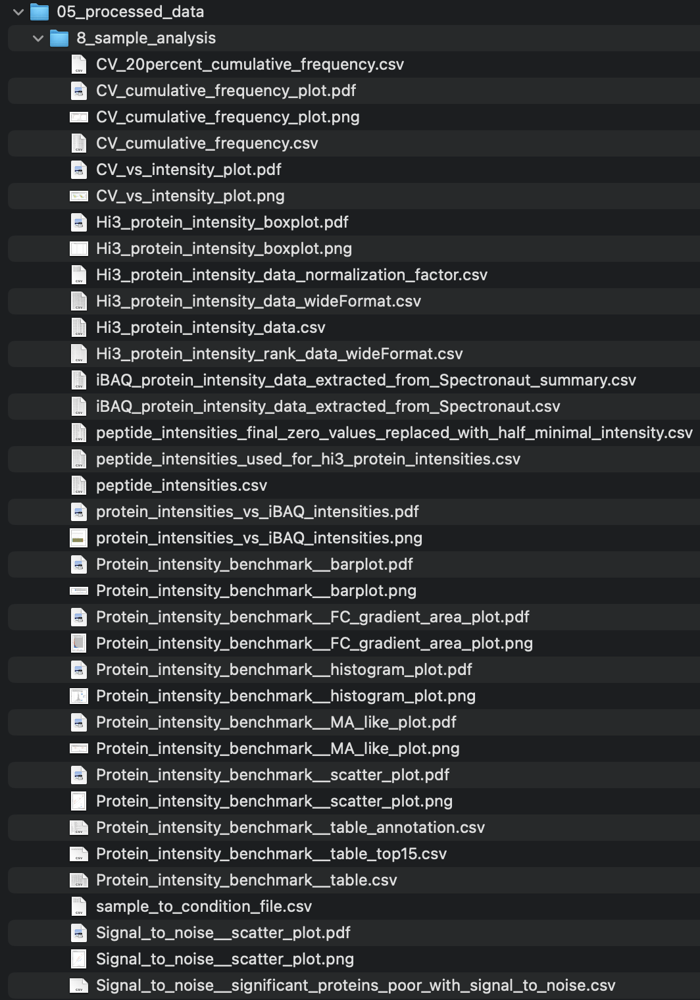

```{r, include = FALSE}
knitr::opts_chunk$set(
  eval = FALSE,
  collapse = TRUE,
  comment = "#>"
)
library(kableExtra)
library(tidyverse)
library(readxl)
table_font_size <- 10
```


::: {#Tip1 .greeting .message style="color: blue;"}

**If you want to have a closer look at the images and plots just do a
"right-click" on the image and select "open in new tab"**
:::

::: {#Tip2 .greeting .message style="color: green;"}
**The output folders contained figures that were always exported in two file formats: vector PDF and raster PNG.**

<u>Recommendations for MacOS Users</u>

For MacOS users, it is recommended to use the PDF files, for example in Keynote, to achieve better quality.

<u>Recommendations for Windows Users</u>

For Windows users, it is recommended to use the PNG files, as applications like Microsoft PowerPoint can sometimes have issues when working with vector graphics.

:::

# SpectroPipeR - normalization and quantification module

The `norm_quant_module()` function serves to further process the data from the `read_spectronaut_module()`; utilizes the read_spectronaut_module output:

<u>**data normalization:**</u> - normalize the ion data using the median-median normalization or auto-detect if the data was already normalized in Spectronaut using e.g. local cross-run normalization (If normalization was conducted using Spectronaut, the median-median normalization step is omitted, and the data normalized by Spectronaut is utilized.)

<u>**(optional) batch adjusting:**</u> - provides the batch adjusting functionality if needed using the ComBat methodology described in Johnson _et al._ 2007 <doi:10.1093/biostatistics/kxj037>

<u>**(optional) covariate adjusting:**</u> - provides the covariate adjusting functionality if needed using the lm() function and the user specified meta data and formula to calculate the residuals per peptides which are back-transformed to intensities by adding the mean peptide intensity.

<u>**protein quantification:**</u> - protein quantification can be either done by Hi3 (project-wide determination of Hi3 peptides) or MaxLFQ approach (iq package <doi:10.1093/bioinformatics/btz961>) or directLFQ

EG.TotalQuantity (Settings) column is used for the quantification. 
Per default MS2 level should be selected in the quantification setting in Spectronaut™.


## norm_quant_module() workflow

1. load read_spectronaut_module() output
2. (optional) check batch or covariate adjustment inputs
3. auto-detect if normalization was done inside Spectrout, if yes use this normalization if not use median-median normalization
4. calculate/ectract normalization factors
5. generate plots for normalization factors/raw/normalized ion intensities
6. calculate ion coefficient of variation (CV) globally and per missed cleavage
7. calculate peptide intensities by summing up the ion intensities per peptide sequence
8. replacing 0 peptide intensity values with the half-minimal peptide intensity value
9. (optional) filter out methionine-oxidized peptides
10. (optional) perform batch adjusting using ComBat; PCA of data before and after adjusting
11. (optional) perform covariate adjusting of data; PCA of data before and after adjusting
12. calculate protein intensity from peptide intensities (Hi3 or MaxLFQ)
13. extract iBAQ intensities (optional - covariate adjustment)
14. calculate protein intensity CV
15. compare protein int. (Hi3 or MaxLFQ) vs. iBAQ
16. calc. cumulative frequency of CV
17. generate sample to condition file including measurement order
18. generate plots & table outputs

### background informations

#### coefficient of variation (CV)

`coefficient of variation (CV) = standard deviation / mean`

The coefficient of variation (CV) is a measure of the variability of a dataset, and it is commonly used in proteomics to assess the reproducibility of protein abundance measurements. In the given context, the CV is observed to be higher in the low abundant range of the protein intensity and lower in the mid to higher abundant range.

Several factors can influence the CV, including: sample preparation, sample type, Mass Spectrometry (MS) methodology

#### Hi3 protein intensity

Hi3 uses the mean over the highest 2-3 peptides per protein defined by the median over the whole dataset.

#### iBAQ protein intensity

The iBAQ (intensity-Based Absolute Quantification) is a method used in proteomics to estimate the relative abundance of proteins within a sample. The iBAQ value for a protein is calculated by dividing the total intensity (sum of peptide intensities) of the protein by the number of theoretically observable tryptic peptides for that protein. This normalizes the protein intensity by the number of peptides that can be detected. Schwanhäusser _et al._, 2011 <doi:10.1038/nature10098>

#### MaxLFQ protein intensity

MaxLFQ stands for Maximal Peptide Ratio Extraction and Label-Free Quantification. It is an algorithm used to estimate protein abundances in mass spectrometry-based proteomics by aiming to maintain the fragment intensity ratios between samples. The MaxLFQ algorithm calculates protein intensities by taking the maximum peptide ratio of all peptides that map to a protein and normalizing it across all samples.

The MaxLFQ algorithm was developed by Cox _et al._ in 2014 <doi:10.1074/mcp.M113.031591> and is widely used in label-free quantitative proteomics. It is considered to be an accurate method for proteome-wide label-free quantification.

In more technical terms, the MaxLFQ algorithm calculates ratio between any two samples using the peptide species that are present. The pair-wise protein ratio is then defined as the median of the peptide ratios, to protect against outliers (require a minimal number of two peptide ratios in order for a given protein ratio to be considered valid). At this point the algorithm constructed a triangular matrix containing all pair-wise protein ratios between any two samples, which is the maximal possible quantification information. Then the algorithm perform a least-squares analysis to reconstruct the abundance profile optimally satisfying the individual protein ratios in the matrix based on the sum of squared differences. Then the algorithm rescales the whole profile to the cumulative intensity across samples, thereby preserving the total summed intensity for a protein over all samples.
This procedure is repeated for all proteins, resulting in an accurate abundance profile for each protein across the samples.

#### Batch adjustment of data using ComBat

Batch effects refer to systematic differences between batches (groups) of samples in high-throughput experiments.
These differences can arise due to various factors, such as batch variations in sample preparation, handling, processing procedures and measurement orders. Batch effects can obscure the true biological signal and lead to incorrect conclusions if not properly accounted for.
In the SpectroPipeR pipeline, the ComBat tool was employed to adjust for batch effects in the datasets where the batch covariate was known. ComBat utilizes the methodology described in Johnson _et al._ 2007 <doi:10.1093/biostatistics/kxj037>.
It uses an empirical Bayes (EB) framework for adjusting data for batch effects that is robust to outliers in small sample sizes and performs comparable to existing methods for large samples. Johnson _et al._ 2007 <doi:10.1093/biostatistics/kxj037>
This method incorporates systematic batch biases common across genes in making adjustments, assuming that phenomena resulting in batch effects often affect many genes in similar ways (i.e. increased expression, higher variability, etc). Specifically, the L/S model parameters are estimated that represent the batch effects by pooling information across genes in each batch to shrink the batch effect parameter estimates toward the overall mean of the batch effect estimates (across peptides). These EB estimates are then used to adjust the data for batch effects, providing more robust adjustments for the batch effect on each peptide.
In SpectroPipeR a parametric ComBAT empirical Bayes adjustment is implemented by utilizing the sva-package.
After adjusting the data you may find a PCA analysis plot (Dim. 1-5) of adjusted and un-adjusted data under `05_processed_data`. Following the adjustment of peptide data, protein intensities are then computed.

#### Covariate adjustment

SpectroPipeR is capable of performing covariate adjustment on quantitative data. This adjustment is achieved by utilizing user-provided meta data and a formula. The adjustment process employs the linear model function, lm(), and it operates on the log<sub>10</sub> transformed peptide intensity data. Once the linear model is fitted, the residuals are computed. These residuals are then adjusted back to the original quantitative range by adding the mean peptide intensity across all samples. This ensures that each peptide's quantitative range is preserved. Following the adjustment of peptide data, protein intensities are then computed. Given that iBAQ intensities are derived from the Spectronaut report, they undergo a similar adjustment process as was applied to the peptides.

{width="100%"}

## example code

**norm_quant_module() needs the output of the read_spectronaut_module() !**

```{r}
# step 2: normalize & quantification module
SpectroPipeR_data_quant <- norm_quant_module(SpectroPipeR_data = SpectroPipeR_data)
```

```{r}
# #*****************************************
# # NORMALIZATION & QUANTIFICATION MODULE
# #*****************************************
# 
# sorting Replicates and conditions ...
# NORMALIZATION WAS DONE IN SPECTRONAUT...
# ...skipping normalization step and use Spectronaut normalized data instead...
# save Normalization factor plot ...                                                                        
# save Normalization boxplot ...
# count missed cleavages ...
# save missed cleavage plots...                                                                             
# generate ion CV data...
# save ion CV data plots...
# save ion CV data vs. mean intensity hexbin plots...
# calculating peptide intensity data ...
# writing peptide intensity data ...
# protein intensity calculation ...                                                                         
# extracting iBAQ intensities from Spectronaut report ...
# calc. mean, SD, CV of iBAQ intensities ...
# ... save iBAQ data ...
# perform maxLFQ protein intensity calculation ... (this will take some time)                               
# ... preprocessing data for MaxLFQ estimation ...
# Concatenating secondary ids...
# 
# Removing low intensities...
# 
# ... generate protein list for MaxLFQ estimation ...
# # proteins = 1503, # samples = 8
# 5.1%
# 10%
# 15%
# 20%
# 25%
# 30%
# 35%
# 40%
# 46%
# 51%
# 56%
# 61%
# 66%
# 71%
# 76%
# 81%
# 86%
# 91%
# 96%
# Completed.
# ... calculation of MaxLFQ ...
# 5.1%
# 10%
# 15%
# 20%
# 25%
# 30%
# 35%
# 40%
# 46%
# 51%
# 56%
# 61%
# 66%
# 71%
# 76%
# 81%
# 86%
# 91%
# 96%
# Completed.
# ... generate outputs for MaxLFQ estimation ...
# ... do median normalization of maxLFQ data ...
# ... save MaxLFQ boxplot ...
# ... save MaxLFQ data ...
# ... compare protein intensities and iBAQ protein intensities ...                                           
# ... CV plot calculation ...
# ... render CV plot ...
# _________ normalization done _________
# no outlier detected with 4 fold difference from the median
```


## norm_quant_module() outputs

The output in your specified output folder for the
norm_quant_module() function should look like in this example (03_normalization, 05_processed_data):

{width="30%"}

{width="50%"}

<!-- figures norm quant. Spectronaut data -->

### normalization - figures {.tabset .tabset-pills}

#### normalization_factor_plot

The bar chart, denoted as **normalization_factor_plot**, depicts the normalization factor employed for data normalization. In the event that local cross-run normalization was chosen in Spectronaut, the median of the normalization factors is exhibited. The user-defined cut-off threshold in the SpectroPipeR parameters setting is represented by the solid lines. If a run were to have a normalization factor exceeding the threshold, it would be highlighted in orange on the plot and indicated in the normalization tables. 

{width="50%"}

#### normalization_factor_BOXplot

The boxplot/density chart, denoted as **normalization_factor_BOXplot**, depicts the normalization factor employed for data normalization e.g. if local cross-run normalization was chosen in Spectronaut. 

{width="50%"}


#### normalization_boxplot

The boxplot/density chart, denoted as **normalization_boxplot**, depicts the raw and normalized ion intensities. 

{width="50%"}

#### ion intensity plot of identified and not-identified ions

The boxplot/violin chart, denoted as **ion_intensity_Identified_notIdentified**, displays the identified and not-identified (imputed or background signal) ion intensities. 


#### ion_CV_plot

The **ion_CV_plot** illustrates the ion coefficient of variation (CV) globally and assigned to missed cleavages. 

{width="50%"}


#### ion_intenisty_vs_CV_hexbin_plot

The **ion_intenisty_vs_CV_hexbin_plot** depicts the ion coefficient of variation (CV) in regard to the normalized ion intensity.

{width="80%"}

### normalization - tables {.tabset .tabset-pills}

#### Median_normalization_factors.csv


The **file_list.csv** table contains 4 columns and gives a brief
overview of the files used in the project

- <u>R.FileName</u> is the capped raw file name
- <u>R.Condition</u> is the condition naming which was setup in your
    Spectronaut analysis
- <u>R.Replicate</u> is the replicate number which was setup in your
    Spectronaut analysis
- <u>MedianNormalizationFactor</u> is the normalization factor or in case of local cross run normalization the median of the normalization factors
- <u>normalization_outlier</u> indicator column for an outlier based on the normalization factor threshold the user specified in the SpectroPipeR parameters

```{r,eval = T,echo = F,message=F,warning=F}
kable(read_csv(file = "tables/02__Median_normalization_factors.csv")) %>% 
  kable_styling()
```

### processed data - figures {.tabset .tabset-pills}

#### MaxLFQ_protein_intensity_boxplot

The **MaxLFQ_protein_intensity_boxplot** illustrates the raw and normalized MaxLFQ protein intensities. 

{width="50%"}


#### CV_vs_intensity_plot

The **CV_vs_intensity_plot** depicts the normalized protein intensity vs the coefficient of variation (CV) of the protein intensity.

The horizontal solid line in the figure indicates a CV of 0.1, while the dotted line represents a CV of 0.2. These lines serve as reference points to evaluate the variability of the protein abundance measurements.

The pink labels in the figure show the percentage of proteins that have a CV below 0.1 or 0.2, respectively, in relation to the total number of protein identifications. This information provides insights into the overall reproducibility of the protein abundance measurements within the dataset.

{width="80%"}


#### protein_intensities_vs_iBAQ_intensities

The **protein_intensities_vs_iBAQ_intensities** plot depicts the the ratios between different protein intensity estimation algorithms, such as MaxLFQ and iBAQ. 
This allows the user to assess the relationship and potential differences between these estimation methods.

In the upper panel the plot displays the ratios between the protein intensity estimates, providing a visual representation of the similarities or discrepancies between the different algorithms.

The lower panel of the plot includes a bar chart that shows the count or frequency of the individual protein intensity estimations.

{width="70%"}

#### CV_cumulative_frequency_plot

The **CV_cumulative_frequency_plot** graphically represents the cumulative frequency of the Coefficient of Variation (CV) at both the peptide and protein levels. On the x-axis, the coefficient of variation (CV) is plotted, while the y-axis displays the cumulative frequency. The lines are differentiated by color according to the condition. This enables the user to assess and evaluate the reproducibility of measurements across different conditions in the analysis.

{width="70%"}


### processed data - tables {.tabset .tabset-pills}

#### sample_to_condition_file.csv

The **sample_to_condition_file.csv** table contains the information about the run file name, condition, replicate, run date and resulting measurement order.

-   <u>R.Condition</u> is the condition naming which was setup in your
    Spectronaut analysis
-   <u>R.FileName</u> is the capped raw file name
-   <u>R.Replicate</u> is the replicate number which was setup in your
    Spectronaut analysis
-   <u>R.Run Date</u> raw file run date
-   <u>measurement_order</u> measurement order (integer)

```{r,eval = T,echo = F,message=F,warning=F}
kable(read_csv(file = "tables/02a__sample_to_condition_file.csv")) %>% 
  kable_styling(font_size = table_font_size)
```


#### peptide_intensities.csv

The **peptide_intensities.csv** table contains the information about the calculated peptide intensities. Specifically, this table holds the sum of the normalized ion data for each peptide-sample combination.

-   <u>R.FileName</u> is the capped raw file name
-   <u>R.Replicate</u> is the replicate number which was setup in your
    Spectronaut analysis
-   <u>R.Condition</u> is the condition naming which was setup in your
    Spectronaut analysis
-   <u>PG.ProteinGroups</u> protein group IDs
-   <u>EG.ModifiedPeptide</u> modified peptide sequences
-   <u>PEP.StrippedSequence</u> stripped peptide sequences
-   <u>peptide_intensity</u> peptide intensity

```{r,eval = T,echo = F,message=F,warning=F}
kable(read_csv(file = "tables/02a__peptide_intensities.csv")) %>% 
  kable_styling(font_size = table_font_size)
```

#### peptide_intensities_final.csv

The **peptide_intensities_final.csv** table contains the information about the calculated peptide intensities finalized by e.g. removing methionine oxidized peptides.

-   <u>R.FileName</u> is the capped raw file name
-   <u>R.Replicate</u> is the replicate number which was setup in your
    Spectronaut analysis
-   <u>R.Condition</u> is the condition naming which was setup in your
    Spectronaut analysis
-   <u>PG.ProteinGroups</u> protein group IDs
-   <u>EG.ModifiedPeptide</u> modified peptide sequences
-   <u>PEP.StrippedSequence</u> stripped peptide sequences
-   <u>peptide_intensity</u> peptide intensity

```{r,eval = T,echo = F,message=F,warning=F}
kable(read_csv(file = "tables/02a__peptide_intensities_final.csv")) %>% 
  kable_styling(font_size = table_font_size)
```

#### iBAQ_protein_intensity_data_extracted_from_Spectronaut.csv

The **iBAQ_protein_intensity_data_extracted_from_Spectronaut.csv** table contains the information about the calculated peptide intensities finalized by e.g. removing methionine oxidized peptides.

-   <u>R.FileName</u> is the capped raw file name
-   <u>R.Condition</u> is the condition naming which was setup in your
    Spectronaut analysis
-   <u>R.Replicate</u> is the replicate number which was setup in your
    Spectronaut analysis
-   <u>PG.ProteinGroups</u> protein group IDs
-   <u>iBAQ_intensities</u> SpectroPipeR extracted iBAQ intensities
-   <u>PG.IBAQ_raw</u> Spectronaut iBAQ calculations


Since a protein group can contain more than one protein the number of theoretical peptides may differ. Therefore Spectronaut separates with a ";" e.g. "6179.5;6376.5" (iBAQ intensities from Spectronaut = PG.IBAQ_raw). 
SpectroPipeR uses the mean of the iBAQ values to give an iBAQ estimate for the protein group as well (iBAQ_intensities).

```{r,eval = T,echo = F,message=F,warning=F}
kable(read_csv(file = "tables/02a__iBAQ_protein_intensity_data_extracted_from_Spectronaut.csv")) %>% 
  kable_styling(font_size = table_font_size)
```


#### iBAQ_protein_intensity_data_extracted_from_Spectronaut_summary.csv

The **iBAQ_protein_intensity_data_extracted_from_Spectronaut_summary.csv** table contains the information about the calculated peptide intensities finalized by e.g. removing methionine oxidized peptides.

-   <u>R.Condition</u> is the condition naming which was setup in your
    Spectronaut analysis
-   <u>PG.ProteinGroups</u> protein group IDs
-   <u>mean_iBAQ_intensities</u> mean iBAQ intensities over replicates
-   <u>SD_iBAQ_intensities</u> standard deviation of iBAQ intensities over replicates
-   <u>CV_iBAQ_intensities</u> coefficient of variation of iBAQ intensities over replicates
-   <u>iBAQ_quantiles</u> project specific iBAQ quantile calculated by using the analysis specific mean of iBAQ intensities over all runs


```{r,eval = T,echo = F,message=F,warning=F}
kable(read_csv(file = "tables/02a__iBAQ_protein_int_extracted_from_SN_summary.csv")) %>% 
  kable_styling(font_size = table_font_size)
```

#### maxLFQ_protein_intensity_data.csv

The **maxLFQ_protein_intensity_data.csv** table contains the information about the calculated MaxLFQ protein intensity data calculated by the iq package <doi:10.1093/bioinformatics/btz961> algorithm.


-   <u>PG.ProteinGroups</u> protein group IDs
-   <u>R.FileName</u> is the capped raw file name
-   <u>protein_intensity</u> MaxLFQ intensity
-   <u>R.Condition</u> is the condition naming which was setup in your
    Spectronaut analysis
-   <u>R.Replicate</u> is the replicate number which was setup in your
    Spectronaut analysis
-   <u>intensity_rank</u> MaxLFQ protein intensity rank


```{r,eval = T,echo = F,message=F,warning=F}
kable(read_csv(file = "tables/02a__maxLFQ_protein_intensity_data.csv")) %>% 
  kable_styling(font_size = table_font_size)
```

#### maxLFQ_protein_intensity_data_wideFormat.csv

The **maxLFQ_protein_intensity_data_wideFormat.csv** wide-tablular table contains the information about the calculated MaxLFQ protein intensity data calculated by the iq package (<doi:10.1093/bioinformatics/btz961>) algorithm.

-   <u>PG.ProteinGroups</u> protein group IDs
-   <u>other columns</u> column names = capped R.FileName; values = MaxLFQ intensity

```{r,eval = T,echo = F,message=F,warning=F}
kable(read_csv(file = "tables/02a__maxLFQ_protein_intensity_data_wideFormat.csv")) %>% 
  kable_styling(font_size = table_font_size)
```
#### maxLFQ_protein_intensity_rank_data_wideFormat.csv

The **maxLFQ_protein_intensity_data_wideFormat.csv** wide-tablular table contains the information about the calculated MaxLFQ protein intensity ranks.

-   <u>PG.ProteinGroups</u> protein group IDs
-   <u>other columns</u> column names = capped R.FileName; values = MaxLFQ intensity ranks

```{r,eval = T,echo = F,message=F,warning=F}
kable(read_csv(file = "tables/02a__maxLFQ_protein_intensity_rank_data_wideFormat.csv")) %>% 
  kable_styling(font_size = table_font_size)
```

#### maxLFQ_protein_intensity_data_normalization_factor.csv

The **maxLFQ_protein_intensity_data_normalization_factor.csv** table contains median-median normalization factors of MaxLFQ protein intensity data.

-   <u>R.FileName	</u> protein group IDs
-   <u>maxLFQ_post_calculation_normalization_factor</u> MaxLFQ median-median normalization factor

```{r,eval = T,echo = F,message=F,warning=F}
kable(read_csv(file = "tables/02a__maxLFQ_protein_intensity_data_normalization_factor.csv")) %>% 
  kable_styling(font_size = table_font_size)
```


#### CV_20percent_cumulative_frequency.csv

The **CV_20percent_cumulative_frequency.csv** table contains the cumulative frequency of the CV≤0.2 fraction on peptide and protein intensity level.

-   <u>R.Condition	</u> conditions as provided by Spectronaut report
-   <u>cumulative frequency</u> cumulative frequency
-   <u>CV_cut</u> CV threshold for which the cumulative frequency was calculated
-   <u>level</u> peptide or protein level
-   <u>cumulative frequency proportion</u> cumulative frequency proportion on overall peptide or protein numbers per condition

```{r,eval = T,echo = F,message=F,warning=F}
kable(read_csv(file = "tables/02a__CV_20percent_cumulative_frequency.csv")) %>% 
  kable_styling(font_size = table_font_size)
```

#### CV_cumulative_frequency.csv

The comprehensive **CV_cumulative_frequency.csv** table contains the cumulative frequency on peptide and protein intensity level.

-   <u>R.Condition	</u> conditions as provided by Spectronaut report
-   <u>cumulative frequency</u> cumulative frequency
-   <u>CV_cut</u> CV threshold for which the cumulative frequency was calculated
-   <u>level</u> peptide or protein level
-   <u>cumulative frequency proportion</u> cumulative frequency proportion on overall peptide or protein numbers per condition

```{r,eval = T,echo = F,message=F,warning=F}
kable(read_csv(file = "tables/02a__CV_cumulative_frequency.csv")) %>% 
  kable_styling(font_size = table_font_size)
```


