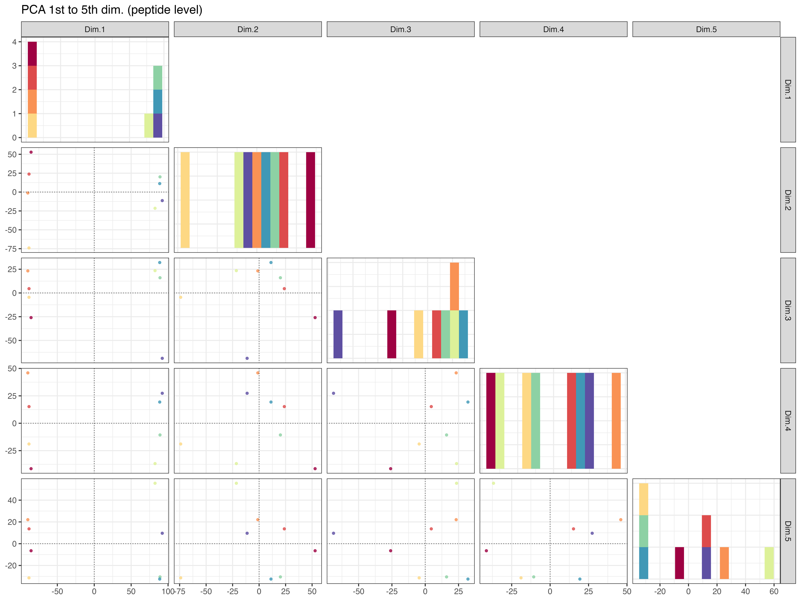

```{r, include = FALSE}
knitr::opts_chunk$set(
  eval = FALSE,
  collapse = TRUE,
  comment = "#>"
)
library(kableExtra)
library(tidyverse)
library(readxl)
table_font_size <- 10
```

::: {#Tip1 .greeting .message style="color: blue;"}
**If you want to have a closer look at the images and plots just do a "right-click" on the image and select "open in new tab"**
:::

::: {#Tip2 .greeting .message style="color: green;"}
**The output folders contained figures that were always exported in two file formats: vector PDF and raster PNG.**

<u>Recommendations for MacOS Users</u>

For MacOS users, it is recommended to use the PDF files, for example in Keynote, to achieve better quality.

<u>Recommendations for Windows Users</u>

For Windows users, it is recommended to use the PNG files, as applications like Microsoft PowerPoint can sometimes have issues when working with vector graphics.
:::

# SpectroPipeR MVA analysis

Multivariate analysis (MVA) is particularly useful for analyzing complex datasets, as it provides a deeper, more nuanced understanding of the relationships between the samples.

## background information

The PCA analysis is performed on the normalized log~2~ peptide (peptide intensity) and log~2~ protein (MaxLFQ or Hi3 intensity) level using all data. The principle component analysis for peptide and protein level was done using the [factomineR package](http://factominer.free.fr), where data was scaled to unit variance.

### PCA

PCA stands for Principal Component Analysis, which is a statistical technique used to reduce the dimensionality of large data sets. It does this by transforming a large set of variables into a smaller one that still contains most of the information in the large set. This is achieved by finding new variables, called principal components, that are linear combinations of the original variables and capture as much of the variation in the data as possible.

The first principal component captures the largest amount of variation in the data, while each subsequent component captures the next largest amount of variation.

A PCA plot is a visual representation of the results of a Principal Component Analysis (PCA). It can help you understand the relationships between the samples in your data by showing how they cluster together based on their similarity.

Samples that are close together on the plot are similar to each other, while samples that are far apart are dissimilar. The direction and length of the arrows on the plot show how each variable contributes to the first and second principal components.

The first and second dimensions of a PCA plot represent the first and second principal components of the data, respectively. These are the two directions in the data that capture the most variation. The first principal component captures the largest amount of variation in the data, while the second principal component captures the second largest amount of variation.

#### HCPC

If HCPC is selected a Hierarchical Clustering on Principle Components will be performed using the metric “euclidean” and method “complete”. The clustering tree is automatically cut at the suggested level (loss of inertia).

### UMAP

UMAP stands for Uniform Manifold Approximation and Projection. It is a dimension reduction technique that can be used for visualization similarly to t-SNE, but also for general non-linear dimension reduction. UMAP is a powerful tool for machine learning practitioners to visualize and understand large, high dimensional datasets. It offers a number of advantages over t-SNE, most notably increased speed and better preservation of the data’s global structure.

To perform a UMAP analysis, the first step is to construct a high-dimensional graph representation of the data. This is done by finding the k-nearest neighbors for each data point and connecting them with edges. The weight of each edge is determined by the distance between the two points it connects. Next, a low-dimensional graph is optimized to be as structurally similar as possible to the high-dimensional graph. This is done using a stochastic gradient descent algorithm that minimizes the cross-entropy between the two graphs.

The result of a UMAP analysis is a low-dimensional representation of the data that can be visualized using a scatter plot. Each point on the plot represents a sample, and its position reflects its values for the first two or three principal components. Samples that are close together on the plot are similar to each other, while samples that are far apart are dissimilar.

In summary, UMAP analysis is performed by constructing a high-dimensional graph representation of the data, then optimizing a low-dimensional graph to be as structurally similar as possible. The result is a low-dimensional representation of the data that can be visualized and used to understand patterns and relationships in the data.

The MVA_module() function will generate:

1.  PCA analysis
2.  (optional) HCPC (hierarchical clustering on principle components) analysis, for more information see [factomineR](http://factominer.free.fr)
3.  correlation analysis
4.  UMAP analysis

## example code

**MVA_module() needs the output of the norm_quant_module() from step 2 of the pipeline!**

```{r}
# step 3: MVA module
MVA_module(SpectroPipeR_data_quant = SpectroPipeR_data_quant)
```

## MVA_module() outputs

The output in your specified output folder for the MVA_module() function should look like in this example (04_multivariate_analysis):

{width="50%"}

<!-- figures MVA. Spectronaut data -->

### MVA - RDS files {.tabset .tabset-pills}

.rds files are a file format used in R to save and load single R objects, such as data frames, models, or lists

The **PCA_analysis\_\_peptide_level.RDS** data R object file contains the PCA data on peptide level

The **PCA_analysis\_\_protein_level.RDS** data R object file contains the PCA data on protein level

The **UMAP_analysis\_\_protein_level.RDS** data R object file contains the UMAP data on protein level

### MVA - figures {.tabset .tabset-pills}

#### correlation_plots

The **correlation_plots** depicts the spearman correlation score (closer to 1 = higher correaltion) on peptide and protein level in a tile plot.

{width="80%"}

{width="80%"}


#### 3D PCA_plots

The **3D_PCA_plot\_\_peptide_level.html** and **3D_PCA_plot\_\_protein_level.html** are interactive 3D representations of the 1st-2nd-3rd dimension of the PCA.

{width="70%"}


#### PCA_plots

The **PCA_plots** encompass a series of graphical representations, arranged from top to bottom. These include a scree plot, a contribution plot, a PCA plot comparing the 1st and 2nd dimensions, and a Biplot. The panel is divided into two sections: the left side illustrates the peptide level, while the right side depicts the protein level.

The scree plot is a visual tool that helps determine the optimal number of components or factors to retain in multivariate analysis by examining the pattern of explained variance across the different components.

The contribution plot depicts the Top10 variable contributions in the determination of a given principal component are (in percentage) : (var.cos2 \* 100) / (total cos2 of the component)

The PCA plot comparing the 1st and 2nd dimensions of the samples.

The biplot displays the relationships between samples and proteins/peptides in a dataset.

{width="70%"}

#### PCA_plot_protein_level_conditions_marked

The **PCA_plot_protein_level_conditions_marked** graphically represents the samples in the 1st and 2nd PCA dimensions at the protein level, with colors indicating their respective conditions.

{width="70%"}

#### PCA_plot_protein_level_replicates_marked

The **PCA_plot_protein_level_replicates_marked** graphically represents the samples in the 1st and 2nd PCA dimensions at the protein level, with colors indicating their respective conditions and text labels indicating the replicates.

{width="70%"}

The **PCA_plot_1st_to_5th_dimension\_\_protein_level** graphically represents the samples in the 1st to the 5th PCA dimensions at the protein level, with colors indicating their respective conditions.

{width="70%"}

#### PCA_plot_protein_level_measurement_order

The **PCA_plot_protein_level_conditions_marked** graphically represents the samples in the 1st and 2nd PCA dimensions at the protein level, with colors indicating the measurement order.

{width="70%"}

The **PCA_plot_1st_to_5th_dimension\_\_protein_level_measurement_order** graphically represents the samples in the 1st to the 5th PCA dimensions at the protein level, with colors indicating the measurement order.

{width="60%"}

#### PCA_plot_1st_to_5th_dimension\_\_peptide_level

The **PCA_plot_1st_to_5th_dimension\_\_peptide_level** graphically represents the samples in the 1st to the 5th PCA dimensions at the peptide level, with colors indicating their respective conditions.

{width="60%"}

#### PCA_plot_1st_to_5th_dimension\_\_peptide_level_measurement_order

The **PCA_plot_1st_to_5th_dimension\_\_peptide_level_measurement_order** graphically represents the samples in the 1st to the 5th PCA dimensions at the peptide level, with colors indicating the measurement order.

{width="60%"}

#### UMAP_plot_protein_level_conditions_marked

The **UMAP_plot_protein_level_conditions_marked** graphically represents the samples in the UMAP dimensions at the protein level, with colors indicating the conditions.

{width="60%"}

#### HCPC - figures

The HCPC performs an agglomerative hierarchical clustering on results from a factor analysis.

In SpectroPipeR it is performed on peptide and protein level.

{width="60%"}

{width="60%"}

{width="60%"}

{width="60%"}

{width="60%"}

{width="60%"}

{width="60%"}

{width="60%"}
