```{r, include = FALSE}
knitr::opts_chunk$set(
  eval = FALSE,
  collapse = TRUE,
  comment = "#>"
)
library(kableExtra)
library(tidyverse)
library(readxl)
table_font_size <- 10
```

::: {#Tip1 .greeting .message style="color: blue;"}
**If you want to have a closer look at the images and plots just do a "right-click" on the image and select "open in new tab"**
:::

::: {#Tip2 .greeting .message style="color: green;"}
**The output folders contained figures that were always exported in two file formats: vector PDF and raster PNG.**

<u>Recommendations for MacOS Users</u>

For MacOS users, it is recommended to use the PDF files, for example in Keynote, to achieve better quality.

<u>Recommendations for Windows Users</u>

For Windows users, it is recommended to use the PNG files, as applications like Microsoft PowerPoint can sometimes have issues when working with vector graphics.
:::

# SpectroPipeR statistics

The statistical analysis is carried out by utilizing the [PECA package](https://bioconductor.org/packages/release/bioc/html/PECA.html).

The recommended test is the "rots" test (ROPECA approach).
This ROPECA (reproducibility-optimized peptide change averaging) approach can be inspected in detail in [Enhanced differential expression statistics for data-independent acquisition proteomics](https://www.nature.com/articles/s41598-017-05949-y).

## background information

### statistical analysis

Pair-wise comparison can be carried out using an ordinary t-test ("t"), modified t-test ("modt"), or reproducibility-optimized test statistic ("rots").
The type of data aggregation can be either median ("median") or tukey ("tukey") for calculating protein values.
The test may be performed paired or unpaired depending on your experimental design.

PECA determines differential gene expression using directly the peptide intensity measurements of proteomic datasets.
An change between two groups of samples is first calculated for each peptide in the datasets.
The protein-level changes are then defined as median/tukey over the peptide level changes.
For more details about the peptide-level expression change averaging (PECA) procedure, see Elo _et al._ (2005) <doi:10.1093/nar/gni193>, Laajala _et al._ (2009) <doi:10.1186/gb-2009-10-7-r77> and Suomi _et al._ (2024) <doi:10.18129/B9.bioc.PECA>

PECA calculates the peptide level changes using the ordinary or modified t-statistic.
The ordinary t-statistic is calculated using the function rowttests in the Bioconductor genefilter package.

**If "modt" is selected modified t-statistic is calculated using limma package (fast processing time):**

The modified t-statistic is calculated using the linear modeling approach in the Bioconductor limma package.

The empirical Bayes moderated t-statistics test each individual contrast equal to zero.
For each protein, the moderated F-statistic tests whether all the contrasts are zero.
The F-statistic is an overall test computed from the set of t-statistics for that peptide This is exactly analogous the relationship between t-tests and F-statistics in conventional anova, except that the residual mean squares have been moderated between proteins.

**If "rots" is selected a Reproducibility-Optimized Test Statistic (ROTS) is calculated using the PECA package (slower processing time):**

The reproducibility-optimization procedure (ROTS) enables the selection of a suitable gene ranking statistic directly from the given dataset.
The statistic is optimized among a family of t-type statistics $$d_\alpha = |\overline{x}_1 - \overline{x}_2| / (\alpha_1 + \alpha_2*s)$$, where $|\overline{x}_1 - \overline{x}_2|$ is the difference between the two group averages of normalized peptide abundances, $\alpha_1$ and $\alpha_2$ are non-negative parameters to be optimized, and $s$ is the pooled standard error.
The optimal statistic is determined by maximizing the reproducibility Z-score $$Z_k(d_\alpha) = (R_k  * d_\alpha - R^0_k * d_\alpha) / s_k * d_\alpha$$ over a lattice of $\alpha_1\in\{0,0.01, ...,5\}$ and $\alpha_2\in\{0,1\}$, $k \in \{0,1,2,...,F\}$, where F is the total number of peptides in the data $R^0_k * d_\alpha$ is the corresponding reproducibility in randomized datasets permuted over samples and $s_k * d_\alpha$ is the standard deviation of the bootstrap distribution.
Reproducibility is defined as the average overlap of $k$ top-ranked peptides over pairs of bootstrapped datasets.
For protein-level inference of differential expression, the median of peptide-level p-values is used as a score for each protein taking the direction of change into account.
The protein-level significance of the detection is then calculated using beta distribution.
Under the null hypothesis, the p-values of the peptides follow the uniform distribution U(0,1).
Furthermore, the order statistics from U(0,1) distribution follow a beta distribution.
Finally, the FDR is calculated using the Benjamini-Hochberg procedure.

This complex and computation intense procedure allow a more precise estimate of significance than other methods.
For further details please see [Suomi & Elo 2017](https://www.nature.com/articles/s41598-017-05949-y#Sec3https://www.nature.com/articles/s41598-017-05949-y#Sec3).

The significance of an expression change is determined based on the analytical p-value of the protein-level test statistic.
Unadjusted p-values are reported along with the corresponding p-values looked up from beta ditribution.
The quality control and filtering of the data (e.g. based on low intensity or peptide specificity) is left to the user.

### Effect size implementation in SpectroPipeR

In SpectroPipeR the effect size (Cohen's d) of peptide ratios per comparisons is implemented as follows.
The peptide intensities were used to calculate the mean scaled peptide intensities per protein.
This step is important since peptides have different intensities due to different flyability in mass spec.
For example if two peptides are injected at 10fmol and one flies much better than the other, then the better flying peptide will have a much higher intensity.
Therefore we need to adjust for this effect and scale the peptides in the same numeric region.
Following the scaling process, the intensities of the scaled peptides were employed to compute Cohen’s d for each protein, facilitating subsequent comparative analysis.

## example code

**statistics_module() needs the output of the norm_quant_module() !**

The condition_comparisons (mandatory) requires a cbind() with the user specified conditions as used during the setup of the analysis in Spectronaut. Therefore provide the conditions, which should be compared in the R code.

```{r}
# condition comparison example
condition_comparisons_example <- cbind(
                                c("condition_1","condition_control"),
                                c("condition_2","condition_control"),
                                c("condition_3","condition_control")
                                )
```

```{r}
# step 4: statistics module
SpectroPipeR_data_stats <- statistics_module(SpectroPipeR_data_quant = SpectroPipeR_data_quant,
                                       condition_comparisons = cbind(c("HYE mix A","HYE mix B")))
```

```{r}
##*****************************************
## STATISTICS MODULE
##*****************************************
#
#reformatting data ...
#register processor cores ...
#performing statistical analysis (this might take a while) ...
#  |=============================================================================================| #100%
#close cores ...
#
#start to end time comparison for stat. analysis: 0.00111424499087863 hours
#estimating effect sizes ...
# [============================================================]  100.00% - calc. effect sizes... 
#
#join and tidy tables ...
#filtering statistical table using supplied cutoffs ...
#writing output files ...
#adding iBAQ quantiles to statistics table ...                                                                  # 
#generating Excel outputs ...                                                                                   # 
#performing fold-change cutoff sensitivity analysis ...                                                         # 
#plotting fold-change cutoff sensitivity analysis ...
# [================================================================================]  100.00% - 1 
#
#plotting fold-change simple cutoff sensitivity analysis (peptide n > 1)...
# [================================================================================]  100.00% - 1 
#
#generating volcano plots ...
# [============================================================]  100.00% - Volcano plots with adj. p-value 
# [============================================================]  100.00% - Volcano plots with adj. p-value 
# [============================================================]  100.00% - Volcano plots with raw p-value 
#
#condition-comparison-wise signal to noise comparison ...
#...signal to noise: save scatter plot...
#condition-comparison-wise comparison of peptide-int.-ratios vs. protein-int.-ratios ...
#...calculating protein ratios...
#...combining ratio tables...
#...generating ratio-ratios: protein_ratios/peptide_ratios...
#...filter for at least 2 peptides...
#...adding of protein intensity to table...
#...add signal to noise per group...
#...add detection with selected q-value cutoff with at least 2 peptides per replicate...
#...add direction comparison for protein or peptide condition comp. ratio...
#...save table of stat. significant with poor signal to noise...
#...counting protein which having a 2fold difference...
#...select Top15 over- or under-estimated proteins...
#...protein int. benchmark: save scatter plot...
#...protein int. benchmark: save histogram plot...
#...protein int. benchmark: save table...
#...counting protein: gradient of difference...                                                                 # 
#...protein int. benchmark: gradient of difference area plots...
#statistical analysis module done --> please check outputs in folder: ../SpectroPipeR_test_folder/06_statistics/  
```

## statistics_module() outputs

The output in your specified output folder for the norm_quant_module() function should look like in this example (06_statistics, 05_processed_data):

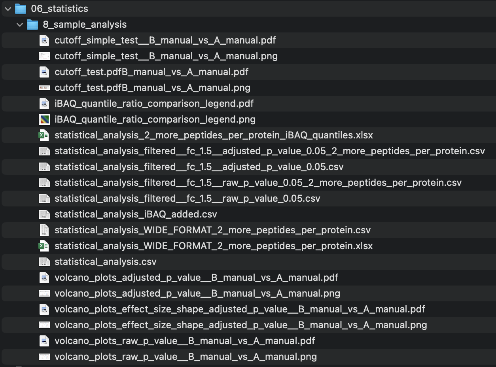{width="30%"} 

{width="30%"}

<!-- figures statistics Spectronaut data -->

### statistics - figures {.tabset .tabset-pills}

#### volcano plots

The **volcano_plots_raw_p_value...** illustrates the volcano plot (raw p-value) of the statistical analysis for a specific comparison.

The blue color indicates lower abundance and the orange indicates higher abundance of the protein in regard to their peptide ratios.

The blue, grey or orange label depicts the number of proteins in each fraction.

The user specified p-value and fold-change threshold are used to determine the fractions.

On the right panel of the plot the Top10 (based on euclidean distance) abundance differences are highlighted for the lower and upper fraction.

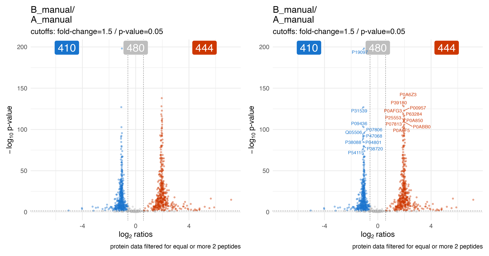{width="80%"}

The **volcano_plots_adjusted_p_value...** illustrates the volcano plot (adjusted p-value / q-value) of the statistical analysis for a specific comparison.

{width="80%"}

The **volcano_plots_effect_size_shape_adjusted_p_value...** illustrates the volcano plot (adjusted p-value / q-value) of the statistical analysis for a specific comparison.
The point shape depicts the estimated effect size.

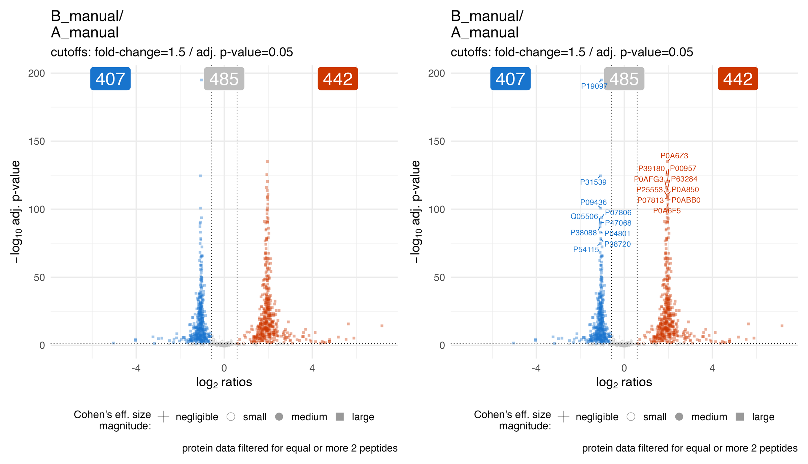{width="80%"}


#### cut-off plots

The **cutoff_test...** & **cutoff_simple_test...** illustrate the protein count by varying the fold-change threshold to filter significant proteins.
They should help to estimate a meaningful project specific fold-change cutoff for the statistical analysis.

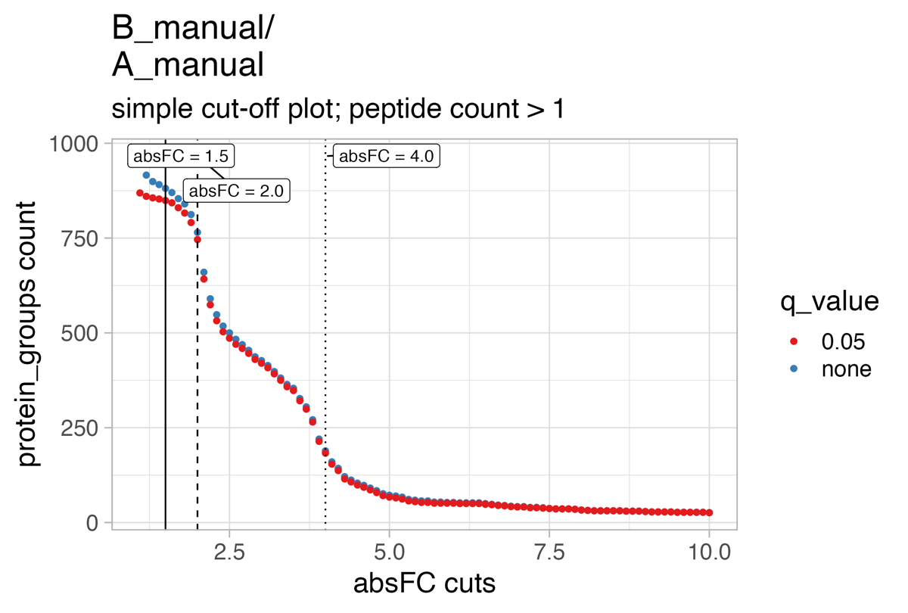{width="60%"}

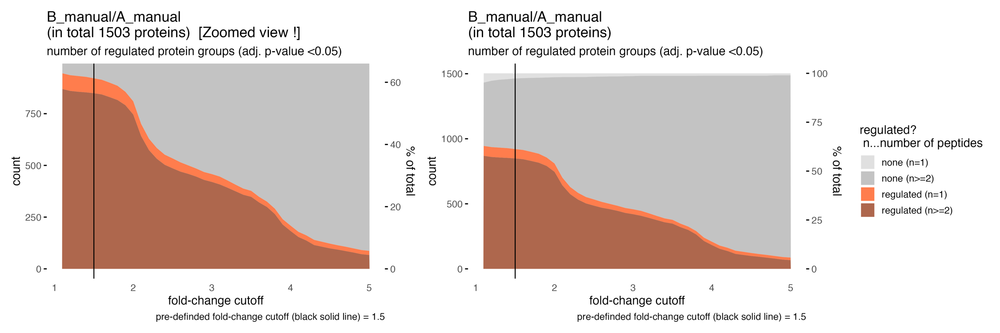{width="90%"}

### statistics - tables {.tabset .tabset-pills}

#### statistical_analysis.csv

The **statistical_analysis.csv** holds the information of the statistical analysis.

-   <u>slr:</u> signal log2-ratios on peptide basis
-   <u>t:</u> t of t-statistics on peptide basis
-   <u>score:</u> score of t-statistics on peptide basis
-   <u>n:</u> number of peptides
-   <u>p:</u> raw p-value of statistics on peptide basis
-   <u>p.fdr:</u> adjusted p-value (q-value) of statistics on peptide basis
-   <u>PG.ProteinGroups:</u> Protein groups
-   <u>group1:</u> group1 of condition comparison
-   <u>group2:</u> group2 of condition comparison
-   <u>slr_ratio_meta:</u> condition comparison; how the ratio is formed
-   <u>test:</u> which test was used for statistics on peptide level
-   <u>type:</u> which type of ratio aggregation to ProteinGroup level was used for signal log2-ratios on peptide basis
-   <u>significant_changed:</u> if there is a significant change FC & q-value (cutoffs e.g.: FC = 1.5 & adjusted-p-value = 0.05)
-   <u>significant_changed_raw_p:</u> if there is a significant change FC & p-value (cutoffs e.g.: FC = 1.5 & p-value = 0.05)
-   <u>significant_changed_fc:</u> fold-change cutoff used for analysis
-   <u>significant_changed_p_value:</u> p-value/q-value cutoff used for analysis
-   <u>fold_change_absolute:</u> ablsolute fold-change
-   <u>fold_change_direction:</u> fold-change direction
-   <u>fold_change:</u> fold-change
-   <u>effect_size_method:</u> effect size estimation method used
-   <u>d:</u> effect size estimate
-   <u>d_pooled_SD:</u> effect size estimate; pooled SD
-   <u>d_95CI_lower:</u> effect size estimate: the lower 95% confidence interval
-   <u>d_95CI_upper:</u> effect size estimate: the upper 95% confidence interval
-   <u>d_magnitute:</u> a qualitative assessment of the magnitude of effect size (\|d\|\<0.2 negligible, \|d\|\<0.5 small, \|d\|\<0.8 medium, otherwise large); Cohen 1992

```{r,eval = T,echo = F,message=F,warning=F}
kable(
read_csv("tables/04__statistical_analysis.csv")
) %>% 
  kable_styling(font_size = table_font_size)
```

The files **statistical_analysis_filtered...** contain the same information but are filtered for:

| file                                                                                                      | filter criteria                                                                                     |
|-------------------|-----------------------------------------------------|
| statistical_analysis_filtered<br>\_\_fc_1.5\_\_raw_p_value_0.05.csv                                       | user-specified abs. fold-change (e.g. 1.5) and raw p-value (e.g. 0.05)                              |
| statistical_analysis_filtered<br>\_\_fc_1.5\_\_raw_p_value_0.05<br>\_2_more_peptides_per_protein.csv      | user-specified abs. fold-change (e.g. 1.5) and raw p-value (e.g. 0.05) and at least 2 peptides      |
| statistical_analysis_filtered<br>\_\_fc_1.5\_\_adjusted_p_value_0.05.csv                                  | user-specified abs. fold-change (e.g. 1.5) and adjusted p-value (e.g. 0.05)                         |
| statistical_analysis_filtered<br>\_\_fc_1.5\_\_adjusted_p_value_0.05<br>\_2_more_peptides_per_protein.csv | user-specified abs. fold-change (e.g. 1.5) and adjusted p-value (e.g. 0.05) and at least 2 peptides |

#### statistical_analysis_2_more_peptides_per_protein_iBAQ_quantiles.xlsx

The Excel table **statistical_analysis_2_more_peptides_per_protein_iBAQ_quantiles.xlsx** (csv file also available) holds the information of the statistical analysis and the iBAQ quantiles associated with the comparisons.

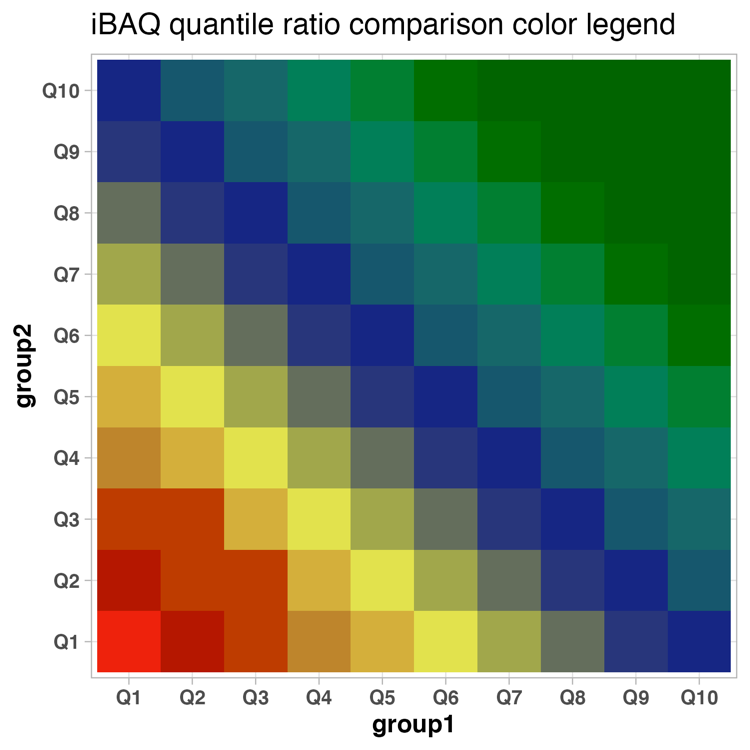{width="40%"}

-   <u>slr:</u> signal log2-ratios on peptide basis
-   <u>iBAQ_quantile_comp:</u> iBAQ quantiles of comparison
-   <u>t:</u> t of t-statistics on peptide basis
-   <u>score:</u> score of t-statistics on peptide basis
-   <u>n:</u> number of peptides
-   <u>p:</u> raw p-value of statistics on peptide basis
-   <u>p.fdr:</u> adjusted p-value (q-value) of statistics on peptide basis
-   <u>PG.ProteinGroups:</u> Protein groups
-   <u>group1:</u> group1 of condition comparison
-   <u>group2:</u> group2 of condition comparison
-   <u>slr_ratio_meta:</u> condition comparison; how the ratio is formed
-   <u>test:</u> which test was used for statistics on peptide level
-   <u>type:</u> which type of ratio aggregation to ProteinGroup level was used for signal log2-ratios on peptide basis
-   <u>significant_changed:</u> if there is a significant change FC & q-value (cutoffs e.g.: FC = 1.5 & adjusted-p-value = 0.05)
-   <u>significant_changed_raw_p:</u> if there is a significant change FC & p-value (cutoffs e.g.: FC = 1.5 & p-value = 0.05)
-   <u>significant_changed_fc:</u> fold-change cutoff used for analysis
-   <u>significant_changed_p_value:</u> p-value/q-value cutoff used for analysis
-   <u>fold_change_absolute:</u> ablsolute fold-change
-   <u>fold_change_direction:</u> fold-change direction
-   <u>fold_change:</u> fold-change
-   <u>effect_size_method:</u> effect size estimation method used
-   <u>d:</u> effect size estimate
-   <u>d_pooled_SD:</u> effect size estimate; pooled SD
-   <u>d_95CI_lower:</u> effect size estimate: the lower 95% confidence interval
-   <u>d_95CI_upper:</u> effect size estimate: the upper 95% confidence interval
-   <u>d_magnitute:</u> a qualitative assessment of the magnitude of effect size (\|d\|\<0.2 negligible, \|d\|\<0.5 small, \|d\|\<0.8 medium, otherwise large); Cohen 1992
-   <u>group1\_\_mean_iBAQ:</u> mean iBAQ intensity of group 1
-   <u>group_1\_\_iBAQ_quantiles:</u> iBAQ intensity quantile of group 1
-   <u>group2\_\_mean_iBAQ:</u> mean iBAQ intensity of group 2
-   <u>group_2\_\_iBAQ_quantiles:</u> iBAQ intensity quantile of group 2

The **statistical_analysis_2_more_peptides_per_protein_iBAQ_quantiles.xlsx** holds information of the statistical analysis.

```{r,eval = T,echo = F,message=F,warning=F}
kable(
read_excel(path= "tables/04__statistical_analysis_2_iBAQ.xlsx")
) %>% 
  kable_styling(font_size = table_font_size)
```

#### statistical_analysis_WIDE_FORMAT_2_more_peptides_per_protein.csv/xlsx

The **statistical_analysis_WIDE_FORMAT_2_more_peptides_per_protein** contains the information of the statistical analysis in wide-tabular format.

-   <u>"comparison";signal_log2_ratio:</u> signal log2-ratios on peptide basis of the specific comparison
-   <u>"comparison";raw_p_value:</u> raw p-value of the specific comparison
-   <u>"comparison";adjusted_p_value:</u> adjusted p-value of the specific comparison

```{r,eval = T,echo = F,message=F,warning=F}
kable(
read_csv("tables/04__statistical_analysis_WIDE_FORMAT_2_more_peptides_per_protein.csv")[1:15,]
) %>% 
  kable_styling(font_size = table_font_size)
```

## Protein intensity estimation comparison

Since bottom-up proteomics measures ions/peptides and not directly proteins the protein intensity estimation is slightly biased depending on the algorithm used.
The ROPECA statistics used peptide ratios which can be compared to protein intensity ratios.
This ratio comparison give researchers insights into the performance and agreement between various protein intensity estimation algorithms used in their proteomics data analysis.
This information can be valuable for selecting the most appropriate estimation method and protein candidates per comparison.

### Processed data - figures {.tabset .tabset-pills}

#### Protein_intensity_benchmark\_\_scatter_plot

The **Protein_intensity_benchmark\_\_scatter_plot** plot depicts the peptide intensity ratio on the x-axis and the protein intensity ratio on the y-axis for proteins with 2 or more peptides.

The solid line shows the diagonal and the dashed lines indicate a 2-fold change.
The count highlights the number of proteins which are affected by a difference above abs.
2 fold-change.
The size of the dots illustrate the number of peptides.
Usually proteins with low number of peptides are stronger affected by a difference between protein intensity estimation ratios, e.g.
MaxLFQ ratios, vs. peptide ratios.

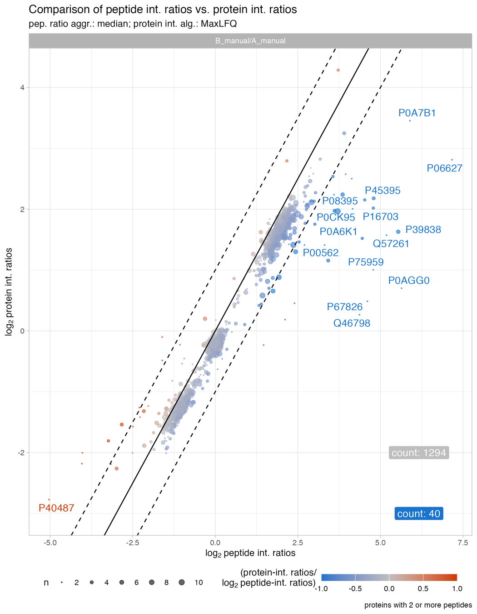{width="60%"}

#### Protein_intensity_benchmark\_\_MA_like_plot

The **Protein_intensity_benchmark\_\_MA_like_plot** plot depicts an MA-like plot of the mean protein intensity (x-axis) and the peptide ratio / protein ratio on the y-axis.
Usually proteins in the low abundant range are stronger affected by a difference between protein intensity estimation ratios and peptide ratios.

The solid line shows the diagonal and the dashed lines indicate a 2fold difference.
The count highlights the number of proteins which are affected by a difference above abs.
2 fold-change.
The size of the dots illustrate the number of peptides.
Usually proteins with low number of peptides are stronger affected by a difference between protein intensity estimation ratios, e.g.
MaxLFQ ratios, and peptide ratios.

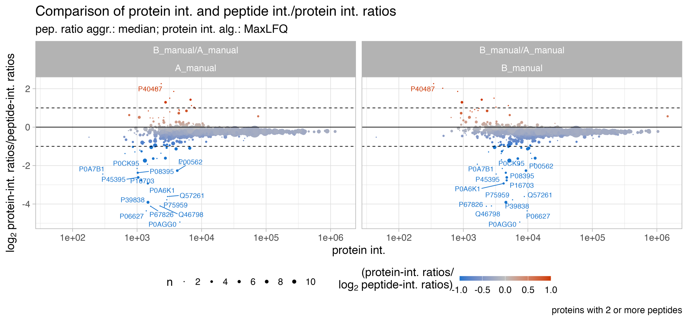{width="80%"}

#### Protein_intensity_benchmark\_\_histogram_plot

The **Protein_intensity_benchmark\_\_histogram_plot** plot depicts a histogram of the the peptide ratio / protein ratio on the x-axis.

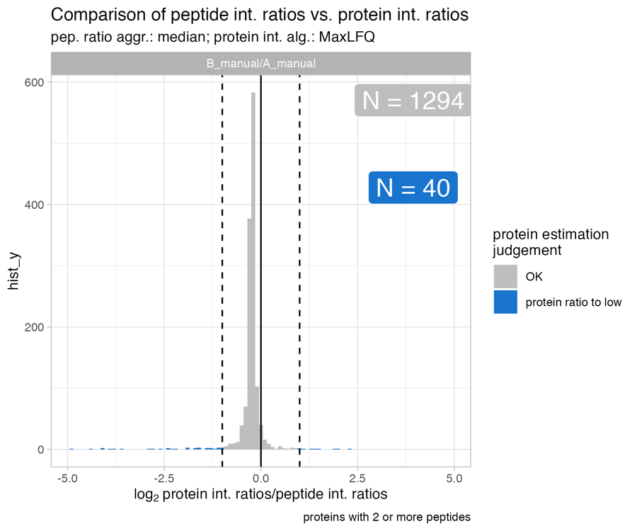{width="60%"}

#### Protein_intensity_benchmark\_\_FC_gradient_area_plot

The **Protein_intensity_benchmark\_\_FC_gradient_area_plot** presents an area plot across a range of fold-changes.
In this instance, at a 1.5-fold change threshold, there are 76 proteins where the protein ratio is more than 1.5-fold to high, and 2 proteins where the protein ratio is more than 1.5-fold to low when compared to the peptide ratios.

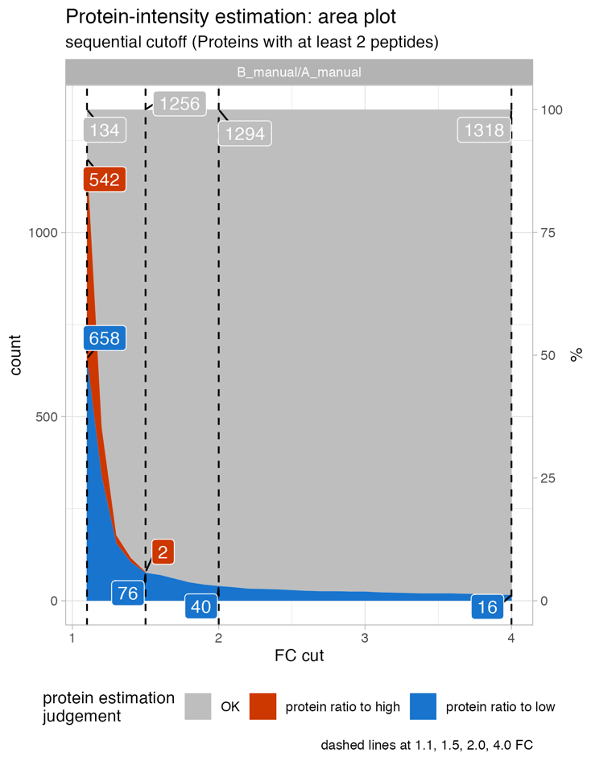{width="60%"}

#### Protein_intensity_benchmark\_\_barplot

The **Protein_intensity_benchmark\_\_barplot** displays a stacked bar plot, summarizing the number of proteins that exhibit a protein intensity ratio exceeding a 2-fold difference when compared to the peptide ratio.

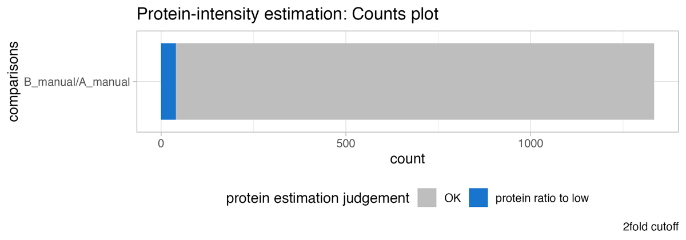{width="60%"}

### processed data - tables {.tabset .tabset-pills}

#### Protein_intensity_benchmark\_\_table.csv

The **Protein_intensity_benchmark\_\_table.csv** table holds all information for the protein intensity ratio vs. peptide intensity ratios on protein level.

##### annotation

```{r,eval = T,echo = F,message=F,warning=F}
kable(
read_csv("tables/04a__Protein_intensity_benchmark__table_annotation.csv")
) %>% 
  kable_styling(font_size = table_font_size)
```

##### table

```{r,eval = T,echo = F,message=F,warning=F}
kable(
read_csv("tables/04a__Protein_intensity_benchmark__table.csv")[1:15,]
) %>% 
  kable_styling(font_size = table_font_size)
```

The **Protein_intensity_benchmark\_\_table_top15.csv** table holds the information of the Top15 most deviating ratio / ratio comparisons.
