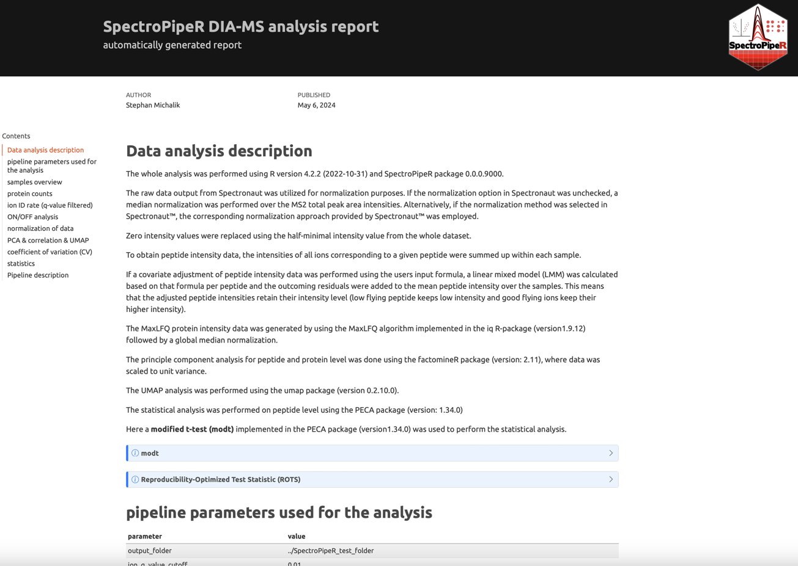

```{r, include = FALSE}
knitr::opts_chunk$set(
  eval = FALSE,
  collapse = TRUE,
  comment = "#>"
)
```


::: {#Tip1 .greeting .message style="color: blue;"}

**If you want to have a closer look at the images and plots just do a
"right-click" on the image and select "open in new tab"**
:::

::: {#Tip2 .greeting .message style="color: green;"}
**The output folders contained figures that were always exported in two file formats: vector PDF and raster PNG.**

<u>Recommendations for MacOS Users</u>

For MacOS users, it is recommended to use the PDF files, for example in Keynote, to achieve better quality.

<u>Recommendations for Windows Users</u>

For Windows users, it is recommended to use the PNG files, as applications like Microsoft PowerPoint can sometimes have issues when working with vector graphics.

:::

# SpectroPipeR reporting

The reporting module takes the inputs from:

- step 1 - read Spectronaut data
- step 2 - normalization and quantification
- step 5 - statistics (optional)

to render an interactive standalone HTML report.
The rendering is performed with **Quarto CLI**. So Quarto CLI is required. If you did not already install the Quarto CLI you should install the Quarto CLI using [Quarto get started installation](https://quarto.org/docs/get-started/).

## SpectroPipeR functions executed before

```{r}
# parameter list
params <- list(output_folder = "../SpectroPipeR_test_folder")

# example input file, bundled with SpectroPipeR package
example_file_path <- system.file("extdata", "SN_test_HYE_mix_file.tsv", package="SpectroPipeR")

# step 1: load Spectronaut data module
SpectroPipeR_data <- read_spectronaut_module(file = example_file_path,
                                      parameter = params,
                                      print.plot = FALSE)

# step 2: normalize & quantification module
SpectroPipeR_data_quant <- norm_quant_module(SpectroPipeR_data = SpectroPipeR_data,print.plot = FALSE)

# step 3: MVA module
MVA_module(SpectroPipeR_data_quant = SpectroPipeR_data_quant)

# step 4: statistics module
SpectroPipeR_data_stats <- statistics_module(SpectroPipeR_data_quant = SpectroPipeR_data_quant,
                                       condition_comparisons = cbind(c("B_manual","A_manual")))

```


## Report generation
```{r}
# step 5: report module
SpectroPipeR_report_module(SpectroPipeR_data = SpectroPipeR_data,
                     SpectroPipeR_data_quant = SpectroPipeR_data_quant,
                     SpectroPipeR_data_stats = SpectroPipeR_data_stats)

```

```{r}
# #*****************************************
# # REPORT MODULE
# #*****************************************
# 
# generating methods part ...
# render HTML report ... this might take a while 
# 
# processing file: DIA_MS_analysis_report_Master.qmd
#   |...............                                    |  30%                   # A tibble: 1 × 1
#   value
#   <chr>
# 1 0.01 
#                                           
# output file: DIA_MS_analysis_report_Master.knit.md
# 
# pandoc --output SpectroPipeR_report.html
#   to: html
#   standalone: true
#   self-contained: true
#   section-divs: true
#   html-math-method: katex
#   wrap: none
#   default-image-extension: png
#   css:
#     - styles.css
#   toc: true
#   toc-depth: 3
#   
# metadata
#   document-css: false
#   link-citations: true
#   date-format: long
#   lang: en
#   title: SpectroPipeR DIA-MS analysis report
#   author: Stephan Michalik
#   date: '`r format(Sys.Date(), "%B %d, %Y")`'
#   title-block-banner: '#151515'
#   subtitle: automatically generated report
#   page-layout: full
#   toc-title: Contents
#   theme: united
#   highlight: tango
#   df_print: paged
#   toc-location: left
#   anchor-sections: true
#   smooth-scroll: true
#   
# Output created: SpectroPipeR_report.html
# 
# render HTML report ... DONE!
```

## SpectroPipeR_report_module() output

{width=80%}

[SpectroPipeR example report](https://stemicha.github.io/SpectroPipeR_examples/species_mix_analysis__2024_07_11__15_06_SpectroPipeR_report.html)

After the function was executed the SpectroPipeR_report.html file was generated inside the output folder.


