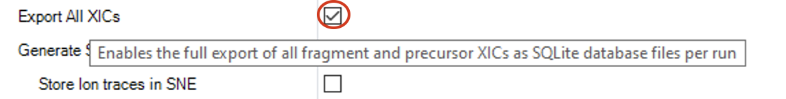
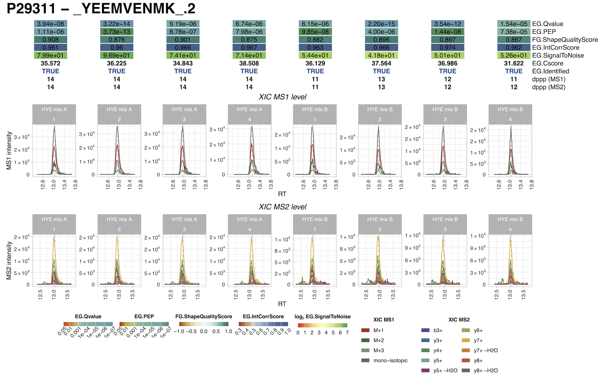

```{r, include = FALSE}
knitr::opts_chunk$set(
  eval = FALSE,
  collapse = TRUE,
  comment = "#>"
)
```


# SpectroPipeR XIC extraction and plotting

## introduction

Evaluating results directly from raw data is highly recommended. While the commercially licensed Spectronaut software offers this functionality, the free Spectronaut Viewer can also be used for this purpose. However, in proteomics research facilities, heavily utilized full Spectronaut licenses can become a bottleneck for routine tasks like XIC (Extracted Ion Chromatogram) inspection. To address this, SpectroPipeR offers the ability to extract and plot XICs directly, if the Spectronaut Pipeline analysis generated the corresponding SQLite files per raw file. This setting can be found within Spectronaut and has to be checked under "Pipeline Mode" settings.


{width="80%"}

If the Spectronaut analysis utilized the SpectroPipeR report export scheme (accessible through the  function `Spectronaut_export_scheme(output_location = "../SpectroPipeR_test_folder")`) and enabled XIC SQLite export, a separate folder containing individual SQLite files for each raw file should be present within the Spectronaut reporting folder.

In order to generate the XIC plots the user just have to point to the Spectronaut report and the XIC SQLite folder to produce XIC pdf files and if desired also ion specific csv files of the XICs.

## example code

```{r}
library(SpectroPipeR)
 #setup example input paths / protein selection for plotting
 Spectronaut_report_path <- system.file("extdata/HYE_demo_data",
                                        "HYE_demo_data_Report_SpectroPipeR.tsv",
                                         package="SpectroPipeR")
 Spectronaut_xicDB_path <- system.file("extdata/HYE_demo_data/XIC_DBs",package="SpectroPipeR")
 protein_groups <- c("P29311","P38720")
 output_path <- "../SpectroPipeR_test_folder/single_XIC_plots"

 # extracting and plotting of XIC
 XIC_plot_module(Spectronaut_report_path = Spectronaut_report_path,
                 Spectronaut_xicDB_path = Spectronaut_xicDB_path,
                 protein_groups = protein_groups,
                 output_path = output_path,
                 export_csv_files = TRUE,
                 number_of_cores = 2
 )
```

```{r}
#> create output dir ...
#> loading Spectronaut report data ...
#> extract ion meta data from report ...
#> extract ion IDs of selected proteins groups ...
#>  [============================================================]  100.00% - XIC extraction... 
#> 
#> add ion meta data to extracted XICs ...
#> register processor cores
#> plotting (this might take a while) ...
#>   |============================================================| 100%
#> DONE ...
```


In the output folder the user can find plots and csv files of the protein group selected ion XICs (MS1/MS2).

{width="90%"}

## explanation of depicted scores

 Description of the Spectronaut scores shown in the output plots:
 
| <u> __parameter__ </u> | <u> __description__ </u>|
|:---------|:--------------------------------------|
| EG.Qvalue | The Q-value is the multiple test corrected p-value. The Q-value can be used as an estimate for the FDR at a given Cscore cutoff.|
| EG.PEP | The posterior error probability for a peptide precursor observation. The PEP is calculated as the decoy probability function for a specficic Cscore divided by the probability function for decoy plus target. PEP = d/(t+d) where d is the value of the decoy probability function for a given Cscore and t is the value for target probability function for a given Cscore. |
| FG.ShapeQualityScore | The average of all available peak quality measurements (scale: 1.0 `best` to -1.0 `worst`) |
| EG.IntCorrScore | The correlation score between the relative fragment intensities as provided by the spectral librarxy and the empirical observed fragtment intensitiers at XIC peak apex. |
| EG.SignalToNoise | The signal to noise ratio of the LC-MS peak for a given peptide precursor. The signal is calc. as the maximum intensity of the fragment sum XIC within the peak boundaries. The noise is calculated as the average fragment sum XIC intensity outside the peak boundaries. |
| EG.Cscore | The discriminant score used for identification. This score is a linear combination of all applicable scores for a certain workflow. |
| EG.Identified | Returns weather a precursor is considered identified or not. In order to be identified it has to match both the precursor and the protein FDR cutoff. |
| dppp (MS1) | Returns the number of data points (scans) that make up the MS1 XIC of the selected LC-MS peak for this precursor. Only data points that lie within the start and the end RT are considered. |
| dppp (MS2) | Returns the number of data points (scans) that make up the MS2 XIC of the selected LC-MS peak for this precursor. Only data points that lie within the start and the end RT are considered. |


