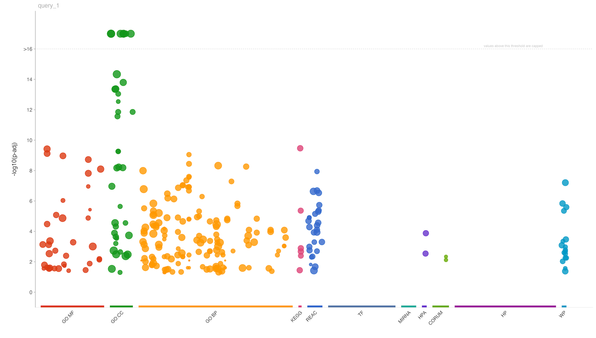
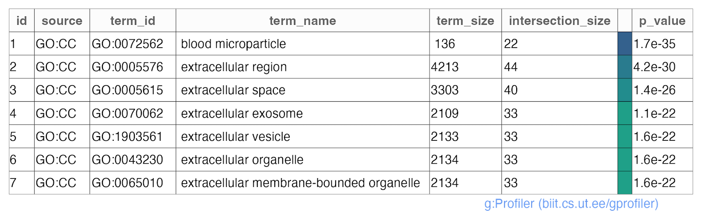

```{r, include = FALSE}
knitr::opts_chunk$set(
  eval = FALSE,
  collapse = TRUE,
  comment = "#>"
)
```

SpectroPipeR does not incorporate a function for functional enrichment analysis due to the existence of numerous solutions, and users may have a preference for their own approach. However, the following code example illustrates the recommended implementation of statistical results files for a functional enrichment analysis using the Gprofiler2 package. For more information, please refer to the [Gprofiler R implementation](https://biit.cs.ut.ee/gprofiler/page/r) and the [R vignette of Gprofiler2](https://cran.r-project.org/web/packages/gprofiler2/vignettes/gprofiler2.html).

# Gprofiler2 code suggestion

```{r, eval=FALSE}
# install gprofiler2 package
install.packages("gprofiler2")

# load packages
library(gprofiler2)
library(tidyverse)

#set working directory or create RStudio project inside your SpectroPipeR output folder
setwd("[your working directory or SpectroPipeR output folder]")

# load SpectroPipeR statistics --------------------------------------------
#path to statistical_analysis.csv
stats <- read_csv("[path]/statistical_analysis.csv")

# filter statistics -------------------------------------------------------
stats_filtered <- stats %>%
  # filter for ≥2 peptides
  filter(n>=2) %>%
  # filter for FC & q-value
  filter(fold_change_absolute >= 2 & p.fdr <= 0.05)


# get statistical comparisons ---------------------------------------------
comparison <- unique(stats_filtered$slr_ratio_meta)


# generate output folder --------------------------------------------------
dir.create("gprofiler_query_Results",showWarnings = F)


# perform Gprofiler analysis in a for loop over comparisons ---------------
for(i in comparison){

  # filter data for comparison
  grpofiler_input <- stats_filtered %>%
    filter(slr_ratio_meta %in% i)

  # Gene list functional enrichment.
  #
  # run gprofiler
  # query         - character vector of protein IDs
  # significant   - whether all or only statistically significant results should be returned.
  #	organism      - Organism names are constructed by concatenating the first letter of the name and
  #                 the family name. Example: human - 'hsapiens', mouse - 'mmusculus'

  grpofiler_res<- gost(query = grpofiler_input$PG.ProteinGroups,
                       significant = T, # only statistically significant results should be returned
                       organism = "hsapiens" # select the right organism
                       )

  # write grpofiler results container
  write_rds(x = grpofiler_res,file = paste0("gprofiler_query_Results/",
                                            str_replace_all(i,"/","_vs_"),".rds"))
  # write grpofiler results table
  write_csv(x = as_tibble(grpofiler_res$result),
            file = paste0("gprofiler_query_Results/",str_replace_all(i,"/","_vs_"),".csv"))

  # write grpofiler results plot
  publish_gostplot(
    p = gostplot(grpofiler_res, interactive = FALSE),
    highlight_terms = NULL,
    filename = paste0("gprofiler_query_Results/",str_replace_all(i,"/","_vs_"),"__plot.png"),
    width = NA,
    height = NA
  )

  # write grpofiler results table
  publish_gosttable(
    gostres = grpofiler_res,
    filename = paste0("gprofiler_query_Results/",str_replace_all(i,"/","_vs_"),"__table.png"),
    highlight_terms = grpofiler_res$result$term_id[which(grpofiler_res$result$p_value<1E-16)]
  )
}

```

## results

Upon execution of the above mentioned code, you will obtain a comprehensive functional enrichment analysis of the statistical results of SpectroPipeR. This analysis is encapsulated within a result container file (.rds), providing a robust and reusable data structure for further exploration. Additionally, the output includes a structured table and a visually compelling plot, offering both tabular and graphical representations of the analysis results. 

### annotated Manhattan plot of enrichment results

{width="70%"}

### table with the functional enrichment analysis results

{width="70%"}


