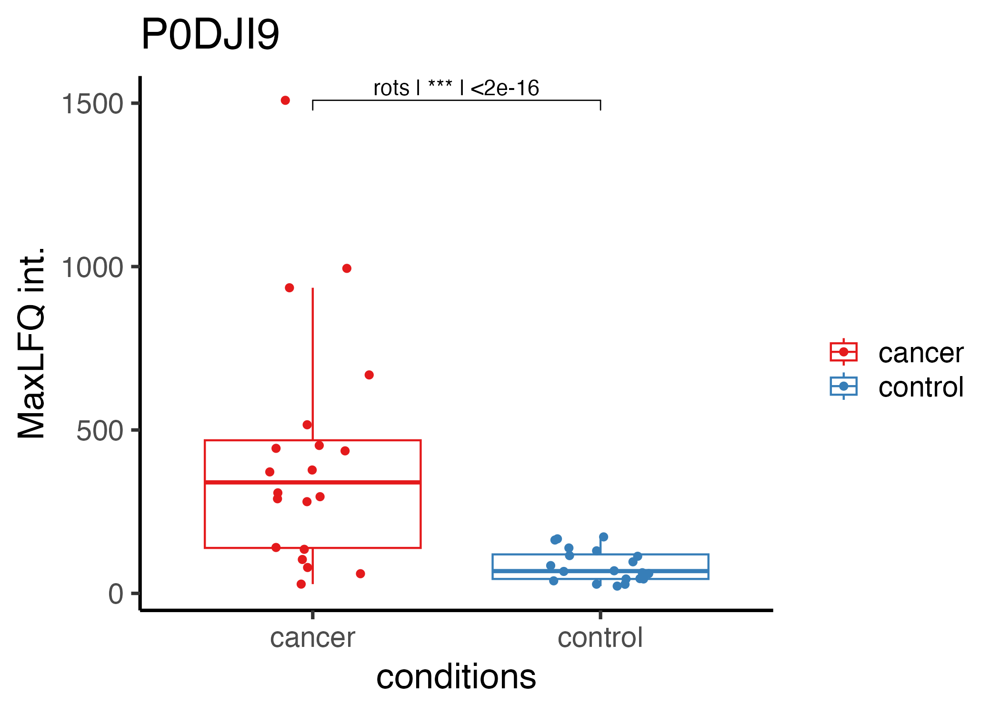

```{r, include = FALSE}
knitr::opts_chunk$set(
  eval = FALSE,
  collapse = TRUE,
  comment = "#>"
)
```

Currently, SpectroPipeR does not possess a function for plotting single protein data due to the complexity and variability inherent in different study designs. The appropriate presentation format can vary significantly depending on whether you have one or multiple reference samples, time-series experiments, multiple mutants, etc. Consequently, selecting a universally suitable presentation format is nearly impossible. However, coding your own plots for several proteins is a skill that can be readily acquired.

Below, you will find a code example for a study investigating a cohort with cancer and control subjects.

In the study from Vitko et al. 2024, plasma samples from 20 late-stage lung cancer patients and 20 control individuals were analyzed using the timsTOF HT mass spectrometer. The samples were processed with the Proteograph Product Suite, which employs five distinct nanoparticles (NP1−5) to compress the dynamic range of the plasma proteome, enabling deeper proteome profiling. Specifically, the NP2 nanoparticle was used for enrichment of plasma. In this example the Evosep/timsTOF HT measurements of NP2 were used.

https://pubs.acs.org/doi/10.1021/acs.jproteome.3c00646

Vitko, D. et al. timsTOF HT Improves Protein Identification and Quantitative Reproducibility for Deep Unbiased Plasma Protein Biomarker Discovery. J. Proteome Res. (2024) doi:10.1021/acs.jproteome.3c00646.


```{r, eval=FALSE}

# load tidyplots
library(tidyverse)
library(ggpubr)


# add asterix function;
add_p_value_asterisks <- function(p_value) {
  if (p_value < 0.001) {
    return("***")
  } else if (p_value < 0.01) {
    return("**")
  } else if (p_value < 0.05) {
    return("*")
  } else {
    return("")
  }
}

# load protein data -------------------------------------------------------
MaxLFQ <- read_csv(file = "[maxLFQ_protein_intensity_data.csv]")
stats <- read_csv(file = "[path to statistical_analysis.csv]")

# filter for statistical signi
stats_filtered <- stats %>% 
  filter(n > 1) %>% # filter: at least 2 peptides per Protein
  filter(p.fdr < 0.05) %>% # filter: adj. p-value < 0.05
  filter(fold_change_absolute > 2) %>% # filter abs. FC > 2
  arrange(desc(slr))

# filter the protein int. for e.g. the Top5 up-regulated proteins
plot_data <- MaxLFQ %>% 
  filter(PG.ProteinGroups %in% stats_filtered$PG.ProteinGroups[1:5])

# filter the peptide-statistics data e.g. the Top5 up-regulated proteins
stats_plot_data <- stats_filtered %>% 
  filter(PG.ProteinGroups %in% plot_data$PG.ProteinGroups)

# calculate maximum value for test label position
plot_data_y_max <- plot_data %>% 
  group_by(PG.ProteinGroups) %>% 
  # add a maximum value for test label position
  summarise(y.position = max(protein_intensity,na.rm =T)+max(protein_intensity,na.rm =T)*0.1)%>% 
  ungroup()

# add data to statistical data & format p-values
stats_plot_data <- left_join(stats_plot_data,plot_data_y_max)
stats_plot_data <- stats_plot_data %>% 
  rowwise() %>% 
  # convert p-value to asterix
  mutate(p.fdr_asterix = add_p_value_asterisks(p.fdr)) %>% 
  # format p-value to scientific notation
  mutate(p.fdr_formatted  = format.pval(p.fdr, digits = 3, scientific = TRUE)) %>% 
  ungroup()


# plot data ---------------------------------------------------------------
#get unique proteins for the loop
proteins <- unique(plot_data$PG.ProteinGroups)

# generate output folder
output_folder_single_plots <- "[output folder path]"
dir.create(output_folder_single_plots)

# start the loop
for(i in proteins){
  plot_tmp<- ggplot(data = plot_data %>% 
           filter(PG.ProteinGroups==i),
         mapping = aes(x = R.Condition,
                       y = protein_intensity,
                       color = R.Condition))+
    geom_boxplot(outlier.colour = NA)+
    geom_jitter(width = 0.2)+
    theme_classic(base_size = 18)+
    labs(title = i, 
         y = "MaxLFQ int.",
         x = "conditions",
         color = "")+
    scale_color_brewer(palette = "Set1")+
    stat_pvalue_manual(
      stats_plot_data %>% 
        filter(PG.ProteinGroups==i) %>% 
        unite(test,p.fdr_asterix,p.fdr_formatted,col = "test_p_label",sep = " | "),
      label = "test_p_label",
      tip.length = 0.02,
      step.increase = 0.05
    )
  #save plot
  ggsave(filename = paste0(output_folder_single_plots,"/",i,".png"),
         plot = plot_tmp,
         device = "png",
         width = 7,
         height = 5)
  rm(plot_tmp)
}
```

The code example above generates plots for the five most significantly altered proteins. Below is an example of one such plot.

{width="70%"}
